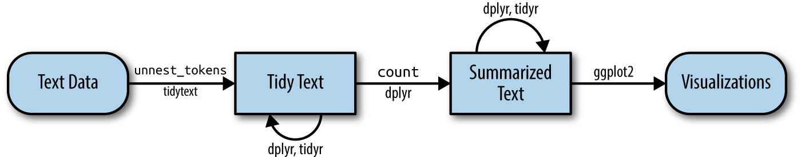

# The tidy text format {#tidytext}

Using tidy data principles is a powerful way to make handling data easier and more effective, and this is no less true when it comes to dealing with text. As described by Hadley Wickham [@tidydata], tidy data has a specific structure:

* Each variable is a column
* Each observation is a row
* Each type of observational unit is a table

We thus define the tidy text format as being **a table with one-token-per-row.** A token is a meaningful unit of text, such as a word, that we are interested in using for analysis, and tokenization is the process of splitting text into tokens. This one-token-per-row structure is in contrast to the ways text is often stored in current analyses, perhaps as strings or in a document-term matrix. For tidy text mining, the **token** that is stored in each row is most often a single word, but can also be an n-gram, sentence, or paragraph. In the tidytext package, we provide functionality to tokenize by commonly used units of text like these and convert to a one-term-per-row format.

Tidy data sets allow manipulation with a standard set of "tidy" tools, including popular packages such as dplyr [@R-dplyr], tidyr [@R-tidyr], ggplot2 [@R-ggplot2], and broom [@R-broom]. By keeping the input and output in tidy tables, users can transition fluidly between these packages. We've found these tidy tools extend naturally to many text analyses and explorations. 

At the same time, the tidytext package doesn't expect a user to keep text data in a tidy form at all times during an analysis. The package includes functions to `tidy()` objects (see the broom package [Robinson et al cited above]) from popular text mining R packages such as tm [@tm] and quanteda [@R-quanteda]. This allows, for example, a workflow where importing, filtering, and processing is done using dplyr and other tidy tools, after which the data is converted into a document-term matrix for machine learning applications. The models can then be re-converted into a tidy form for interpretation and visualization with ggplot2.

## Contrasting tidy text with other data structures

As we stated above, we define the tidy text format as being a table with **one-token-per-row.** Structuring text data in this way means that it conforms to tidy data principles and can be manipulated with a set of consistent tools. This is worth contrasting with the ways text is often stored in text mining approaches.

* **String**: Text can, of course, be stored as strings, i.e., character vectors, within R, and often text data is first read into memory in this form.
* **Corpus**: These types of objects typically contain raw strings annotated with additional metadata and details.
* **Document-term matrix**: This is a sparse matrix describing a collection (i.e., a corpus) of documents with one row for each document and one column for each term. The value in the matrix is typically word count or tf-idf (see Chapter \@ref(tfidf)).

Let's hold off on exploring corpus and document-term matrix objects until Chapter \@ref(dtm), and get down to the basics of converting text to a tidy format.

## The `unnest_tokens` function

Emily Dickinson wrote some lovely text in her time.

```{r text}
text <- c("Because I could not stop for Death -",
          "He kindly stopped for me -",
          "The Carriage held but just Ourselves -",
          "and Immortality")

text
```

This is a typical character vector that we might want to analyze. In order to turn it into a tidy text dataset, we first need to put it into a data frame.

```{r text_df, dependson = "text"}
library(dplyr)
text_df <- tibble(line = 1:4, text = text)

text_df
```

What does it mean that this data frame has printed out as a "tibble"? A tibble is a modern class of data frame within R, available in the dplyr and tibble packages, that has a convenient print method, will not convert strings to factors, and does not use row names. Tibbles are great for use with tidy tools.

Notice that this data frame containing text isn't yet compatible with tidy text analysis, though. We can't filter out words or count which occur most frequently, since each row is made up of multiple combined words. We need to convert this so that it has **one-token-per-document-per-row**. 

```{block, type = "rmdnote"}
A token is a meaningful unit of text, most often a word, that we are interested in using for further analysis, and tokenization is the process of splitting text into tokens. 
```

In this first example, we only have one document (the poem), but we will explore examples with multiple documents soon.

Within our tidy text framework, we need to both break the text into individual tokens (a process called *tokenization*) *and* transform it to a tidy data structure. To do this, we use tidytext's `unnest_tokens()` function.

```{r dependson = "text_df", R.options = list(dplyr.print_max = 10)}
library(tidytext)

text_df %>%
  unnest_tokens(word, text)
```

The two basic arguments to `unnest_tokens` used here are column names. First we have the output column name that will be created as the text is unnested into it (`word`, in this case), and then the input column that the text comes from (`text`, in this case). Remember that `text_df` above has a column called `text` that contains the data of interest.

After using `unnest_tokens`, we've split each row so that there is one token (word) in each row of the new data frame; the default tokenization in `unnest_tokens()` is for single words, as shown here. Also notice:

* Other columns, such as the line number each word came from, are retained.
* Punctuation has been stripped.
* By default, `unnest_tokens()` converts the tokens to lowercase, which makes them easier to compare or combine with other datasets. (Use the `to_lower = FALSE` argument to turn off this behavior).

Having the text data in this format lets us manipulate, process, and visualize the text using the standard set of tidy tools, namely dplyr, tidyr, and ggplot2, as shown in Figure \@ref(fig:tidyflow-ch1).

```{r tidyflow-ch1, echo = FALSE, out.width = '100%', fig.cap = "A flowchart of a typical text analysis using tidy data principles. This chapter shows how to summarize and visualize text using these tools."}

```


## Tidying the works of Jane Austen {#tidyausten}

Let's use the text of Jane Austen's 6 completed, published novels from the [janeaustenr](https://cran.r-project.org/package=janeaustenr) package [@R-janeaustenr], and transform them into a tidy format. The janeaustenr package provides these texts in a one-row-per-line format, where a line in this context is analogous to a literal printed line in a physical book. Let’s start with that, and also use `mutate()` to annotate a `linenumber` quantity to keep track of lines in the original format and a `chapter` (using a regex) to find where all the chapters are.

```{r original_books}
library(janeaustenr)
library(dplyr)
library(stringr)

original_books <- austen_books() %>%
  group_by(book) %>%
  mutate(linenumber = row_number(),
         chapter = cumsum(str_detect(text, 
                                     regex("^chapter [\\divxlc]",
                                           ignore_case = TRUE)))) %>%
  ungroup()

original_books
```

To work with this as a tidy dataset, we need to restructure it in the **one-token-per-row** format, which as we saw earlier is done with the `unnest_tokens()` function.

```{r tidy_books_raw, dependson = "original_books"}
library(tidytext)
tidy_books <- original_books %>%
  unnest_tokens(word, text)

tidy_books
```

This function uses the [tokenizers](https://github.com/ropensci/tokenizers) package to separate each line of text in the original data frame into tokens. The default tokenizing is for words, but other options include characters, n-grams, sentences, lines, paragraphs, or separation around a regex pattern.

Now that the data is in one-word-per-row format, we can manipulate it with tidy tools like dplyr. Often in text analysis, we will want to remove stop words; stop words are words that are not useful for an analysis, typically extremely common words such as "the", "of", "to", and so forth in English. We can remove stop words (kept in the tidytext dataset `stop_words`) with an `anti_join()`.

```{r tidy_books, dependson = "tidy_books_raw"}
data(stop_words)

tidy_books <- tidy_books %>%
  anti_join(stop_words)
```

The `stop_words` dataset in the tidytext package contains stop words from three lexicons. We can use them all together, as we have here, or `filter()` to only use one set of stop words if that is more appropriate for a certain analysis.

We can also use dplyr's `count()` to find the most common words in all the books as a whole.

```{r dependson = "tidy_books"}
tidy_books %>%
  count(word, sort = TRUE) 
```

Because we've been using tidy tools, our word counts are stored in a tidy data frame. This allows us to pipe this directly to the ggplot2 package, for example to create a visualization of the most common words (Figure \@ref(fig:plotcount)).

```{r plotcount, dependson = "tidy_books", fig.cap="The most common words in Jane Austen's novels"}
library(ggplot2)

tidy_books %>%
  count(word, sort = TRUE) %>%
  filter(n > 600) %>%
  mutate(word = reorder(word, n)) %>%
  ggplot(aes(n, word)) +
  geom_col() +
  labs(y = NULL)
```

Note that the `austen_books()` function started us with exactly the text we wanted to analyze, but in other cases we may need to perform cleaning of text data, such as removing copyright headers or formatting. You'll see examples of this kind of pre-processing in the case study chapters, particularly Chapter \@ref(pre-processing-text). 

## The gutenbergr package

Now that we've used the janeaustenr package to explore tidying text, let's introduce the [gutenbergr](https://github.com/ropensci/gutenbergr) package [@R-gutenbergr]. The gutenbergr package provides access to the public domain works from the [Project Gutenberg](https://www.gutenberg.org/) collection. The package includes tools both for downloading books (stripping out the unhelpful header/footer information), and a complete dataset of Project Gutenberg metadata that can be used to find works of interest. In this book, we will mostly use the function `gutenberg_download()` that downloads one or more works from Project Gutenberg by ID, but you can also use other functions to explore metadata, pair Gutenberg ID with title, author, language, etc., or gather information about authors. 


```{block, type = "rmdtip"}
To learn more about gutenbergr, check out the [package's documentation at rOpenSci](https://docs.ropensci.org/gutenbergr/), where it is one of rOpenSci's packages for data access.
```

## Word frequencies

A common task in text mining is to look at word frequencies, just like we have done above for Jane Austen's novels, and to compare frequencies across different texts. We can do this intuitively and smoothly using tidy data principles. We already have Jane Austen's works; let's get two more sets of texts to compare to. First, let's look at some science fiction and fantasy novels by H.G. Wells, who lived in the late 19th and early 20th centuries. Let's get [*The Time Machine*](https://www.gutenberg.org/ebooks/35), [*The War of the Worlds*](https://www.gutenberg.org/ebooks/36), [*The Invisible Man*](https://www.gutenberg.org/ebooks/5230), and [*The Island of Doctor Moreau*](https://www.gutenberg.org/ebooks/159). We can access these works using `gutenberg_download()` and the Project Gutenberg ID numbers for each novel.

```{r eval = FALSE}
library(gutenbergr)

hgwells <- gutenberg_download(c(35, 36, 5230, 159))
```

```{r hgwells, echo = FALSE}
load("data/hgwells.rda")
```

```{r tidy_hgwells, dependson = "hgwells"}
tidy_hgwells <- hgwells %>%
  unnest_tokens(word, text) %>%
  anti_join(stop_words)
```

Just for kicks, what are the most common words in these novels of H.G. Wells?

```{r dependson = "tidy_hgwells"}
tidy_hgwells %>%
  count(word, sort = TRUE)
```

Now let's get some well-known works of the Brontë sisters, whose lives overlapped with Jane Austen's somewhat but who wrote in a rather different style. Let's get [*Jane Eyre*](https://www.gutenberg.org/ebooks/1260), [*Wuthering Heights*](https://www.gutenberg.org/ebooks/768), [*The Tenant of Wildfell Hall*](https://www.gutenberg.org/ebooks/969), [*Villette*](https://www.gutenberg.org/ebooks/9182), and [*Agnes Grey*](https://www.gutenberg.org/ebooks/767). We will again use the Project Gutenberg ID numbers for each novel and access the texts using `gutenberg_download()`.

```{r eval = FALSE}
bronte <- gutenberg_download(c(1260, 768, 969, 9182, 767))
```

```{r echo = FALSE}
load("data/bronte.rda")
```

```{r tidy_bronte, dependson = "bronte"}
tidy_bronte <- bronte %>%
  unnest_tokens(word, text) %>%
  anti_join(stop_words)
```

What are the most common words in these novels of the Brontë sisters?

```{r dependson = "tidy_bronte"}
tidy_bronte %>%
  count(word, sort = TRUE)
```

Interesting that "time", "eyes", and "hand" are in the top 10 for both H.G. Wells and the Brontë sisters.

Now, let's calculate the frequency for each word for the works of Jane Austen, the Brontë sisters, and H.G. Wells by binding the data frames together. We can use `pivot_wider()` and `pivot_longer()` from tidyr to reshape our dataframe so that it is just what we need for plotting and comparing the three sets of novels.

```{r frequency, dependson = c("tidy_bronte", "tidy_hgwells", "tidy_books")}
library(tidyr)

frequency <- bind_rows(mutate(tidy_bronte, author = "Brontë Sisters"),
                       mutate(tidy_hgwells, author = "H.G. Wells"), 
                       mutate(tidy_books, author = "Jane Austen")) %>% 
  mutate(word = str_extract(word, "[a-z']+")) %>%
  count(author, word) %>%
  group_by(author) %>%
  mutate(proportion = n / sum(n)) %>% 
  select(-n) %>% 
  pivot_wider(names_from = author, values_from = proportion) %>%
  pivot_longer(`Brontë Sisters`:`H.G. Wells`,
               names_to = "author", values_to = "proportion")

frequency
```

We use `str_extract()` here because the UTF-8 encoded texts from Project Gutenberg have some examples of words with underscores around them to indicate emphasis (like italics). The tokenizer treated these as words, but we don't want to count "\_any\_" separately from "any" as we saw in our initial data exploration before choosing to use `str_extract()`. 

Now let's plot (Figure \@ref(fig:plotcompare)).

```{r plotcompare, dependson = "frequency", fig.width=10, fig.height=5, fig.cap="Comparing the word frequencies of Jane Austen, the Brontë sisters, and H.G. Wells"}
library(scales)

# expect a warning about rows with missing values being removed
ggplot(frequency, aes(x = proportion, y = `Jane Austen`, 
                      color = abs(`Jane Austen` - proportion))) +
  geom_abline(color = "gray40", lty = 2) +
  geom_jitter(alpha = 0.1, size = 2.5, width = 0.3, height = 0.3) +
  geom_text(aes(label = word), check_overlap = TRUE, vjust = 1.5) +
  scale_x_log10(labels = percent_format()) +
  scale_y_log10(labels = percent_format()) +
  scale_color_gradient(limits = c(0, 0.001), 
                       low = "darkslategray4", high = "gray75") +
  facet_wrap(~author, ncol = 2) +
  theme(legend.position="none") +
  labs(y = "Jane Austen", x = NULL)
```

Words that are close to the line in these plots have similar frequencies in both sets of texts, for example, in both Austen and Brontë texts ("miss", "time", "day" at the upper frequency end) or in both Austen and Wells texts ("time", "day", "brother" at the high frequency end). Words that are far from the line are words that are found more in one set of texts than another. For example, in the Austen-Brontë panel, words like "elizabeth", "emma", and "fanny" (all proper nouns) are found in Austen's texts but not much in the Brontë texts, while words like "arthur" and "dog" are found in the Brontë texts but not the Austen texts. In comparing H.G. Wells with Jane Austen, Wells uses words like "beast", "guns", "feet", and "black" that Austen does not, while Austen uses words like "family", "friend", "letter", and "dear" that Wells does not.

Overall, notice in Figure \@ref(fig:plotcompare) that the words in the Austen-Brontë panel are closer to the zero-slope line than in the Austen-Wells panel. Also notice that the words extend to lower frequencies in the Austen-Brontë panel; there is empty space in the Austen-Wells panel at low frequency. These characteristics indicate that Austen and the Brontë sisters use more similar words than Austen and H.G. Wells. Also, we see that not all the words are found in all three sets of texts and there are fewer data points in the panel for Austen and H.G. Wells.

Let's quantify how similar and different these sets of word frequencies are using a correlation test. How correlated are the word frequencies between Austen and the Brontë sisters, and between Austen and Wells?

```{r cor_test, dependson = "frequency"}
cor.test(data = frequency[frequency$author == "Brontë Sisters",],
         ~ proportion + `Jane Austen`)
cor.test(data = frequency[frequency$author == "H.G. Wells",], 
         ~ proportion + `Jane Austen`)
```

Just as we saw in the plots, the word frequencies are more correlated between the Austen and Brontë novels than between Austen and H.G. Wells.

## Summary

In this chapter, we explored what we mean by tidy data when it comes to text, and how tidy data principles can be applied to natural language processing. When text is organized in a format with one token per row, tasks like removing stop words or calculating word frequencies are natural applications of familiar operations within the tidy tool ecosystem. The one-token-per-row framework can be extended from single words to n-grams and other meaningful units of text, as well as to many other analysis priorities that we will consider in this book.
