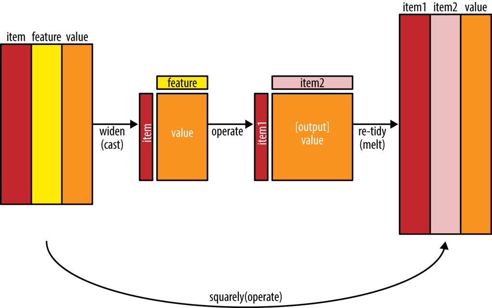

# Relationships between words: n-grams and correlations {#ngrams}

So far we've considered words as individual units, and considered their relationships to sentiments or to documents. However, many interesting text analyses are based on the relationships between words, whether examining which words tend to follow others immediately, or that tend to co-occur within the same documents.

In this chapter, we'll explore some of the methods tidytext offers for calculating and visualizing relationships between words in your text dataset. This includes the `token = "ngrams"` argument, which tokenizes by pairs of adjacent words rather than by individual ones. We'll also introduce two new packages: [ggraph](https://github.com/thomasp85/ggraph), which extends ggplot2 to construct network plots, and [widyr](https://github.com/dgrtwo/widyr), which calculates pairwise correlations and distances within a tidy data frame. Together these expand our toolbox for exploring text within the tidy data framework.

## Tokenizing by n-gram

We've been using the `unnest_tokens` function to tokenize by word, or sometimes by sentence, which is useful for the kinds of sentiment and frequency analyses we've been doing so far. But we can also use the function to tokenize into consecutive sequences of words, called **n-grams**. By seeing how often word X is followed by word Y, we can then build a model of the relationships between them.

We do this by adding the `token = "ngrams"` option to `unnest_tokens()`, and setting `n` to the number of words we wish to capture in each n-gram. When we set `n` to 2, we are examining pairs of two consecutive words, often called "bigrams":

```{r austen_bigrams}
library(dplyr)
library(tidytext)
library(janeaustenr)

austen_bigrams <- austen_books() %>%
  unnest_tokens(bigram, text, token = "ngrams", n = 2) %>%
  filter(!is.na(bigram))

austen_bigrams
```

This data structure is still a variation of the tidy text format. It is structured as one-token-per-row (with extra metadata, such as `book`, still preserved), but each token now represents a bigram.

```{block, type = "rmdnote"}
Notice that these bigrams overlap: "sense and" is one token, while "and sensibility" is another.
```

### Counting and filtering n-grams

Our usual tidy tools apply equally well to n-gram analysis. We can examine the most common bigrams using dplyr's `count()`:

```{r, dependson = "austen_bigrams"}
austen_bigrams %>%
  count(bigram, sort = TRUE)
```

As one might expect, a lot of the most common bigrams are pairs of common (uninteresting) words, such as `of the` and `to be`: what we call "stop-words" (see Chapter \@ref(tidytext)). This is a useful time to use tidyr's `separate()`, which splits a column into multiple based on a delimiter. This lets us separate it into two columns, "word1" and "word2", at which point we can remove cases where either is a stop-word.

```{r bigram_counts, dependson = "austen_bigrams"}
library(tidyr)

bigrams_separated <- austen_bigrams %>%
  separate(bigram, c("word1", "word2"), sep = " ")

bigrams_filtered <- bigrams_separated %>%
  filter(!word1 %in% stop_words$word) %>%
  filter(!word2 %in% stop_words$word)

# new bigram counts:
bigram_counts <- bigrams_filtered %>% 
  count(word1, word2, sort = TRUE)

bigram_counts
```

We can see that names (whether first and last or with a salutation) are the most common pairs in Jane Austen books.

In other analyses, we may want to work with the recombined words. tidyr's `unite()` function is the inverse of `separate()`, and lets us recombine the columns into one. Thus, "separate/filter/count/unite" let us find the most common bigrams not containing stop-words.

```{r bigrams_united, dependson = "bigram_counts"}
bigrams_united <- bigrams_filtered %>%
  unite(bigram, word1, word2, sep = " ")

bigrams_united
```

In other analyses you may be interested in the most common trigrams, which are consecutive sequences of 3 words. We can find this by setting `n = 3`:

```{r}
austen_books() %>%
  unnest_tokens(trigram, text, token = "ngrams", n = 3) %>%
  filter(!is.na(trigram)) %>%
  separate(trigram, c("word1", "word2", "word3"), sep = " ") %>%
  filter(!word1 %in% stop_words$word,
         !word2 %in% stop_words$word,
         !word3 %in% stop_words$word) %>%
  count(word1, word2, word3, sort = TRUE)
```

### Analyzing bigrams

This one-bigram-per-row format is helpful for exploratory analyses of the text. As a simple example, we might be interested in the most common "streets" mentioned in each book:

```{r bigrams_filtered_street, dependson = "bigram_counts"}
bigrams_filtered %>%
  filter(word2 == "street") %>%
  count(book, word1, sort = TRUE)
```

A bigram can also be treated as a term in a document in the same way that we treated individual words. For example, we can look at the tf-idf (Chapter \@ref(tfidf)) of bigrams across Austen novels. These tf-idf values can be visualized within each book, just as we did for words (Figure \@ref(fig:bigramtfidf)).

```{r bigram_tf_idf, dependson = "bigram_counts"}
bigram_tf_idf <- bigrams_united %>%
  count(book, bigram) %>%
  bind_tf_idf(bigram, book, n) %>%
  arrange(desc(tf_idf))

bigram_tf_idf
```

```{r bigramtfidf, dependson = "bigram_tf_idf", echo = FALSE, fig.width=6, fig.height=8, fig.cap = "Bigrams with the highest tf-idf from each Jane Austen novel"}
library(ggplot2)

bigram_tf_idf %>%
  arrange(desc(tf_idf)) %>%
  group_by(book) %>%
  slice_max(tf_idf, n = 10) %>%
  ungroup() %>%
  mutate(bigram = reorder(bigram, tf_idf)) %>%
  ggplot(aes(tf_idf, bigram, fill = book)) +
  geom_col(show.legend = FALSE) +
  facet_wrap(~ book, ncol = 2, scales = "free") +
  labs(x = "tf-idf of bigram", y = NULL)
```

Much as we discovered in Chapter \@ref(tfidf), the units that distinguish each Austen book are almost exclusively names. We also notice some pairings of a common verb and a name, such as "replied elinor" in *Sense & Sensibility*, or "cried catherine" in *Northanger Abbey*.

There are advantages and disadvantages to examining the tf-idf of bigrams rather than individual words. Pairs of consecutive words might capture structure that isn't present when one is just counting single words, and may provide context that makes tokens more understandable (for example, "maple grove", in *Emma*, is more informative than "maple"). However, the per-bigram counts are also *sparser*: a typical two-word pair is rarer than either of its component words. Thus, bigrams can be especially useful when you have a very large text dataset.

### Using bigrams to provide context in sentiment analysis

Our sentiment analysis approach in Chapter \@ref(sentiment) simply counted the appearance of positive or negative words, according to a reference lexicon. One of the problems with this approach is that a word's context can matter nearly as much as its presence. For example, the words "happy" and "like" will be counted as positive, even in a sentence like "I'm not **happy** and I don't **like** it!"

Now that we have the data organized into bigrams, it's easy to tell how often words are preceded by a word like "not":

```{r dependson = "bigrams_separated"}
bigrams_separated %>%
  filter(word1 == "not") %>%
  count(word1, word2, sort = TRUE)
```

By performing sentiment analysis on the bigram data, we can examine how often sentiment-associated words are preceded by "not" or other negating words. We could use this to ignore or even reverse their contribution to the sentiment score.

Let's use the AFINN lexicon for sentiment analysis, which you may recall gives a numeric sentiment value for each word, with positive or negative numbers indicating the direction of the sentiment.

```{r eval=FALSE}
AFINN <- get_sentiments("afinn")

AFINN
```

```{r AFINN_ngrams, echo=FALSE}
load("data/afinn.rda")
AFINN <- afinn

AFINN
```


We can then examine the most frequent words that were preceded by "not" and were associated with a sentiment.

```{r not_words, dependson = c("austen_bigrams", "AFINN_ngrams")}
not_words <- bigrams_separated %>%
  filter(word1 == "not") %>%
  inner_join(AFINN, by = c(word2 = "word")) %>%
  count(word2, value, sort = TRUE)

not_words
```

For example, the most common sentiment-associated word to follow "not" was "like", which would normally have a (positive) score of 2.

It's worth asking which words contributed the most in the "wrong" direction. To compute that, we can multiply their value by the number of times they appear (so that a word with a value of +3 occurring 10 times has as much impact as a word with a sentiment value of +1 occurring 30 times). We visualize the result with a bar plot (Figure \@ref(fig:notwordsplot)).

```{r notwordsplot, dependson = "not_words", fig.cap = "Words preceded by 'not' that had the greatest contribution to sentiment values, in either a positive or negative direction"}

library(ggplot2)

not_words %>%
  mutate(contribution = n * value) %>%
  arrange(desc(abs(contribution))) %>%
  head(20) %>%
  mutate(word2 = reorder(word2, contribution)) %>%
  ggplot(aes(n * value, word2, fill = n * value > 0)) +
  geom_col(show.legend = FALSE) +
  labs(x = "Sentiment value * number of occurrences",
       y = "Words preceded by \"not\"")
```

The bigrams "not like" and "not help" were overwhelmingly the largest causes of misidentification, making the text seem much more positive than it is. But we can see phrases like "not afraid" and "not fail" sometimes suggest text is more negative than it is.

"Not" isn't the only term that provides some context for the following word. We could pick four common words (or more) that negate the subsequent term, and use the same joining and counting approach to examine all of them at once.

```{r negated_words, dependson = "bigrams_separated"}
negation_words <- c("not", "no", "never", "without")

negated_words <- bigrams_separated %>%
  filter(word1 %in% negation_words) %>%
  inner_join(AFINN, by = c(word2 = "word")) %>%
  count(word1, word2, value, sort = TRUE)

```

We could then visualize what the most common words to follow each particular negation are (Figure \@ref(fig:negatedwords)). While "not like" and "not help" are still the two most common examples, we can also see pairings such as "no great" and "never loved." We could combine this with the approaches in Chapter \@ref(sentiment) to reverse the AFINN values of each word that follows a negation. These are just a few examples of how finding consecutive words can give context to text mining methods.

```{r negatedwords, dependson = "negated_words", fig.width=7, fig.height=7, echo = FALSE, fig.cap = "Most common positive or negative words to follow negations such as 'never', 'no', 'not', and 'without'"}
negated_words %>%
  mutate(contribution = n * value,
         word2 = reorder(paste(word2, word1, sep = "__"), contribution)) %>%
  group_by(word1) %>%
  slice_max(abs(contribution), n = 12, with_ties = FALSE) %>%
  ggplot(aes(word2, contribution, fill = n * value > 0)) +
  geom_col(show.legend = FALSE) +
  facet_wrap(~ word1, scales = "free") +
  scale_x_discrete(labels = function(x) gsub("__.+$", "", x)) +
  xlab("Words preceded by negation term") +
  ylab("Sentiment value * # of occurrences") +
  coord_flip()
```

### Visualizing a network of bigrams with ggraph

We may be interested in visualizing all of the relationships among words simultaneously, rather than just the top few at a time. As one common visualization, we can arrange the words into a network, or "graph." Here we'll be referring to a "graph" not in the sense of a visualization, but as a combination of connected nodes. A graph can be constructed from a tidy object since it has three variables:

* **from**: the node an edge is coming from
* **to**: the node an edge is going towards
* **weight**: A numeric value associated with each edge

The [igraph](http://igraph.org/) package has many powerful functions for manipulating and analyzing networks. One way to create an igraph object from tidy data is the `graph_from_data_frame()` function, which takes a data frame of edges with columns for "from", "to", and edge attributes (in this case `n`):

```{r bigram_graph, dependson = "bigram_counts"}
library(igraph)

# original counts
bigram_counts

# filter for only relatively common combinations
bigram_graph <- bigram_counts %>%
  filter(n > 20) %>%
  graph_from_data_frame()

bigram_graph
```

igraph has plotting functions built in, but they're not what the package is designed to do, so many other packages have developed visualization methods for graph objects. We recommend the ggraph package [@R-ggraph], because it implements these visualizations in terms of the grammar of graphics, which we are already familiar with from ggplot2.

We can convert an igraph object into a ggraph with the `ggraph` function, after which we add layers to it, much like layers are added in ggplot2. For example, for a basic graph we need to add three layers: nodes, edges, and text.

```{r bigramgraph, dependson = "bigram_graph", fig.width = 9, fig.height = 7, fig.cap = "Common bigrams in Jane Austen's novels, showing those that occurred more than 20 times and where neither word was a stop word"}
library(ggraph)
set.seed(2017)

ggraph(bigram_graph, layout = "fr") +
  geom_edge_link() +
  geom_node_point() +
  geom_node_text(aes(label = name), vjust = 1, hjust = 1)
```

In Figure \@ref(fig:bigramgraph), we can visualize some details of the text structure. For example, we see that salutations such as "miss", "lady", "sir", and "colonel" form common centers of nodes, which are often followed by names. We also see pairs or triplets along the outside that form common short phrases ("half hour", "thousand pounds", or "short time/pause").

We conclude with a few polishing operations to make a better looking graph (Figure \@ref(fig:bigramggraphausten2)):

* We add the `edge_alpha` aesthetic to the link layer to make links transparent based on how common or rare the bigram is
* We add directionality with an arrow, constructed using `grid::arrow()`, including an `end_cap` option that tells the arrow to end before touching the node
* We tinker with the options to the node layer to make the nodes more attractive (larger, blue points)
* We add a theme that's useful for plotting networks, `theme_void()`

```{r bigramggraphausten2, dependson = "bigram_graph", fig.width = 9, fig.height = 7, fig.cap = "Common bigrams in Jane Austen's novels, with some polishing"}
set.seed(2020)

a <- grid::arrow(type = "closed", length = unit(.15, "inches"))

ggraph(bigram_graph, layout = "fr") +
  geom_edge_link(aes(edge_alpha = n), show.legend = FALSE,
                 arrow = a, end_cap = circle(.07, 'inches')) +
  geom_node_point(color = "lightblue", size = 5) +
  geom_node_text(aes(label = name), vjust = 1, hjust = 1) +
  theme_void()
```

It may take some experimentation with ggraph to get your networks into a presentable format like this, but the network structure is useful and flexible way to visualize relational tidy data.

```{block, type = "rmdnote"}
Note that this is a visualization of a **Markov chain**, a common model in text processing. In a Markov chain, each choice of word depends only on the previous word. In this case, a random generator following this model might spit out "dear", then "sir", then "william/walter/thomas/thomas's", by following each word to the most common words that follow it. To make the visualization interpretable, we chose to show only the most common word to word connections, but one could imagine an enormous graph representing all connections that occur in the text.
```

### Visualizing bigrams in other texts

We went to a good amount of work in cleaning and visualizing bigrams on a text dataset, so let's collect it into a function so that we easily perform it on other text datasets.

```{block, type = "rmdnote"}
To make it easy to use the `count_bigrams()` and `visualize_bigrams()` yourself, we've also reloaded the packages necessary for them. 
```

```{r visualize_bigrams}
library(dplyr)
library(tidyr)
library(tidytext)
library(ggplot2)
library(igraph)
library(ggraph)

count_bigrams <- function(dataset) {
  dataset %>%
    unnest_tokens(bigram, text, token = "ngrams", n = 2) %>%
    separate(bigram, c("word1", "word2"), sep = " ") %>%
    filter(!word1 %in% stop_words$word,
           !word2 %in% stop_words$word) %>%
    count(word1, word2, sort = TRUE)
}

visualize_bigrams <- function(bigrams) {
  set.seed(2016)
  a <- grid::arrow(type = "closed", length = unit(.15, "inches"))
  
  bigrams %>%
    graph_from_data_frame() %>%
    ggraph(layout = "fr") +
    geom_edge_link(aes(edge_alpha = n), show.legend = FALSE, arrow = a) +
    geom_node_point(color = "lightblue", size = 5) +
    geom_node_text(aes(label = name), vjust = 1, hjust = 1) +
    theme_void()
}
```

At this point, we could visualize bigrams in other works, such as the King James Version of the Bible:

```{r eval = FALSE}
# the King James version is book 10 on Project Gutenberg:
library(gutenbergr)
kjv <- gutenberg_download(10)
```

```{r kjv, echo = FALSE}
load("data/kjv.rda")
```

```{r kjvbigrams, dependson = c("kjv", "visualize_bigrams"), fig.width = 9, fig.height = 7, fig.cap = "Directed graph of common bigrams in the King James Bible, showing those that occurred more than 40 times"}
library(stringr)

kjv_bigrams <- kjv %>%
  count_bigrams()

# filter out rare combinations, as well as digits
kjv_bigrams %>%
  filter(n > 40,
         !str_detect(word1, "\\d"),
         !str_detect(word2, "\\d")) %>%
  visualize_bigrams()
```

Figure \@ref(fig:kjvbigrams) thus lays out a common "blueprint" of language within the Bible, particularly focused around "thy" and "thou" (which could probably be considered stopwords!) You can use the gutenbergr package and these `count_bigrams`/`visualize_bigrams` functions to visualize bigrams in other classic books you're interested in.

## Counting and correlating pairs of words with the widyr package

Tokenizing by n-gram is a useful way to explore pairs of adjacent words. However, we may also be interested in words that tend to co-occur within particular documents or particular chapters, even if they don't occur next to each other.

Tidy data is a useful structure for comparing between variables or grouping by rows, but it can be challenging to compare between rows: for example, to count the number of times that two words appear within the same document, or to see how correlated they are. Most operations for finding pairwise counts or correlations need to turn the data into a wide matrix first.

```{r widyr, echo = FALSE, out.width = '100%', fig.cap = "The philosophy behind the widyr package, which can perform operations such as counting and correlating on pairs of values in a tidy dataset. The widyr package first 'casts' a tidy dataset into a wide matrix, performs an operation such as a correlation on it, then re-tidies the result."}

```

We'll examine some of the ways tidy text can be turned into a wide matrix in Chapter \@ref(dtm), but in this case it isn't necessary. The [widyr](https://github.com/dgrtwo/widyr) package makes operations such as computing counts and correlations easy, by simplifying the pattern of "widen data, perform an operation, then re-tidy data" (Figure \@ref(fig:widyr)). We'll focus on a set of functions that make pairwise comparisons between groups of observations (for example, between documents, or sections of text).

### Counting and correlating among sections

Consider the book "Pride and Prejudice" divided into 10-line sections, as we did (with larger sections) for sentiment analysis in Chapter \@ref(sentiment). We may be interested in what words tend to appear within the same section.

```{r austen_section_words}
austen_section_words <- austen_books() %>%
  filter(book == "Pride & Prejudice") %>%
  mutate(section = row_number() %/% 10) %>%
  filter(section > 0) %>%
  unnest_tokens(word, text) %>%
  filter(!word %in% stop_words$word)

austen_section_words
```

One useful function from widyr is the `pairwise_count()` function. The prefix `pairwise_` means it will result in one row for each pair of words in the `word` variable. This lets us count common pairs of words co-appearing within the same section:

```{r count_pairs_words, dependson = "austen_section_words"}
library(widyr)

# count words co-occuring within sections
word_pairs <- austen_section_words %>%
  pairwise_count(word, section, sort = TRUE)

word_pairs
```

Notice that while the input had one row for each pair of a document (a 10-line section) and a word, the output has one row for each pair of words. This is also a tidy format, but of a very different structure that we can use to answer new questions.

For example, we can see that the most common pair of words in a section is "Elizabeth" and "Darcy" (the two main characters). We can easily find the words that most often occur with Darcy:

```{r}
word_pairs %>%
  filter(item1 == "darcy")
```

### Pairwise correlation {#pairwise-correlation}

Pairs like "Elizabeth" and "Darcy" are the most common co-occurring words, but that's not particularly meaningful since *they're also the most common individual words.* We may instead want to examine **correlation** among words, which indicates how often they appear together relative to how often they appear separately.

In particular, here we'll focus on the [phi coefficient](https://en.wikipedia.org/wiki/Phi_coefficient), a common measure for binary correlation. The focus of the phi coefficient is how much more likely it is that either **both** word X and Y appear, or **neither** do, than that one appears without the other.

Consider the following table:

|  | Has word Y | No word Y | Total |  |
|------------|---------------|---------------|--------------|---|
| Has word X | $n_{11}$ | $n_{10}$ | $n_{1\cdot}$ |  |
| No word X | $n_{01}$ | $n_{00}$ | $n_{0\cdot}$ |  |
| Total | $n_{\cdot 1}$ | $n_{\cdot 0}$ | n |  |

For example, that $n_{11}$ represents the number of documents where both word X and word Y appear, $n_{00}$ the number where neither appears, and $n_{10}$ and $n_{01}$ the cases where one appears without the other. In terms of this table, the phi coefficient is:

$$\phi=\frac{n_{11}n_{00}-n_{10}n_{01}}{\sqrt{n_{1\cdot}n_{0\cdot}n_{\cdot0}n_{\cdot1}}}$$

```{block, type = "rmdnote"}
The phi coefficient is equivalent to the Pearson correlation, which you may have heard of elsewhere when it is applied to binary data.
```

The `pairwise_cor()` function in widyr lets us find the phi coefficient between words based on how often they appear in the same section. Its syntax is similar to `pairwise_count()`.

```{r word_cors}
# we need to filter for at least relatively common words first
word_cors <- austen_section_words %>%
  group_by(word) %>%
  filter(n() >= 20) %>%
  pairwise_cor(word, section, sort = TRUE)

word_cors
```

This output format is helpful for exploration. For example, we could find the words most correlated with a word like "pounds" using a `filter` operation.

```{r dependson = "word_cors"}
word_cors %>%
  filter(item1 == "pounds")
```

This lets us pick particular interesting words and find the other words most associated with them (Figure \@ref(fig:wordcors)).

```{r wordcors, dependson = "word_cors", fig.height = 6, fig.width = 6, fig.cap = "Words from Pride and Prejudice that were most correlated with 'elizabeth', 'pounds', 'married', and 'pride'"}
word_cors %>%
  filter(item1 %in% c("elizabeth", "pounds", "married", "pride")) %>%
  group_by(item1) %>%
  slice_max(correlation, n = 6) %>%
  ungroup() %>%
  mutate(item2 = reorder(item2, correlation)) %>%
  ggplot(aes(item2, correlation)) +
  geom_bar(stat = "identity") +
  facet_wrap(~ item1, scales = "free") +
  coord_flip()
```

Just as we used ggraph to visualize bigrams, we can use it to visualize the correlations and clusters of words that were found by the widyr package (Figure \@ref(fig:wordcorsnetwork)).

```{r wordcorsnetwork, dependson = "word_cors", fig.height = 7, fig.width = 8, fig.cap = "Pairs of words in Pride and Prejudice that show at least a .15 correlation of appearing within the same 10-line section"}
set.seed(2016)

word_cors %>%
  filter(correlation > .15) %>%
  graph_from_data_frame() %>%
  ggraph(layout = "fr") +
  geom_edge_link(aes(edge_alpha = correlation), show.legend = FALSE) +
  geom_node_point(color = "lightblue", size = 5) +
  geom_node_text(aes(label = name), repel = TRUE) +
  theme_void()
```

Note that unlike the bigram analysis, the relationships here are symmetrical, rather than directional (there are no arrows). We can also see that while pairings of names and titles that dominated bigram pairings are common, such as "colonel/fitzwilliam", we can also see pairings of words that appear close to each other, such as "walk" and "park", or "dance" and "ball".

## Summary

This chapter showed how the tidy text approach is useful not only for analyzing individual words, but also for exploring the relationships and connections between words. Such relationships can involve n-grams, which enable us to see what words tend to appear after others, or co-occurences and correlations, for words that appear in proximity to each other. This chapter also demonstrated the ggraph package for visualizing both of these types of relationships as networks. These network visualizations are a flexible tool for exploring relationships, and will play an important role in the case studies in later chapters. 
