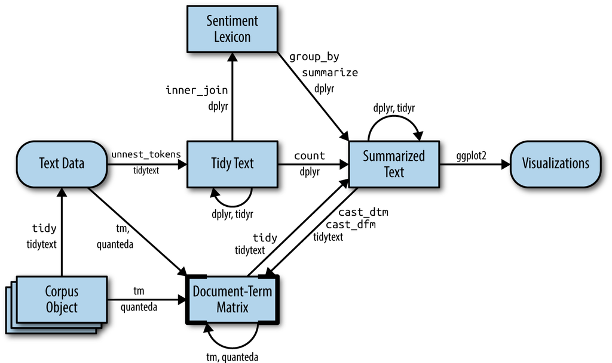

# Converting to and from non-tidy formats {#dtm}

In the previous chapters, we've been analyzing text arranged in the tidy text format: a table with one-token-per-document-per-row, such as is constructed by the `unnest_tokens()` function. This lets us use the popular suite of tidy tools such as dplyr, tidyr, and ggplot2 to explore and visualize text data. We've demonstrated that many informative text analyses can be performed using these tools.

However, most of the existing R tools for natural language processing, besides the tidytext package, aren't compatible with this format. The [CRAN Task View for Natural Language Processing](https://cran.r-project.org/web/views/NaturalLanguageProcessing.html) lists a large selection of packages that take other structures of input and provide non-tidy outputs. These packages are very useful in text mining applications, and many existing text datasets are structured according to these formats.

Computer scientist Hal Abelson has observed that "No matter how complex and polished the individual operations are, it is often the quality of the glue that most directly determines the power of the system" [@Friedman:2008:EPL:1378240]. In that spirit, this chapter will discuss the "glue" that connects the tidy text format with other important packages and data structures, allowing you to rely on both existing text mining packages and the suite of tidy tools to perform your analysis.

```{r tidyflowchartch5, echo = FALSE, out.width = '100%', fig.cap = "A flowchart of a typical text analysis that combines tidytext with other tools and data formats, particularly the tm or quanteda packages. This chapter shows how to convert back and forth between document-term matrices and tidy data frames, as well as converting from a Corpus object to a text data frame."}

```

Figure \@ref(fig:tidyflowchartch5) illustrates how an analysis might switch between tidy and non-tidy data structures and tools. This chapter will focus on the process of tidying document-term matrices, as well as casting a tidy data frame into a sparse matrix. We'll also explore how to tidy Corpus objects, which combine raw text with document metadata, into text data frames, leading to a case study of ingesting and analyzing financial articles.

## Tidying a document-term matrix {#tidy-dtm}

One of the most common structures that text mining packages work with is the [document-term matrix](https://en.wikipedia.org/wiki/Document-term_matrix) (or DTM). This is a matrix where:

* each row represents one document (such as a book or article),
* each column represents one term, and
* each value (typically) contains the number of appearances of that term in that document.

Since most pairings of document and term do not occur (they have the value zero), DTMs are usually implemented as sparse matrices. These objects can be treated as though they were matrices (for example, accessing particular rows and columns), but are stored in a more efficient format. We'll discuss several implementations of these matrices in this chapter.

DTM objects cannot be used directly with tidy tools, just as tidy data frames cannot be used as input for most text mining packages. Thus, the tidytext package provides two verbs that convert between the two formats.

* `tidy()` turns a document-term matrix into a tidy data frame. This verb comes from the broom package [@R-broom], which provides similar tidying functions for many statistical models and objects.
* `cast()` turns a tidy one-term-per-row data frame into a matrix. tidytext provides three variations of this verb, each converting to a different type of matrix: `cast_sparse()` (converting to a sparse matrix from the Matrix package), `cast_dtm()` (converting to a `DocumentTermMatrix` object from tm), and `cast_dfm()` (converting to a `dfm` object from quanteda).

As shown in Figure \@ref(fig:tidyflowchartch5), a DTM is typically comparable to a tidy data frame after a `count` or a `group_by`/`summarize` that contains counts or another statistic for each combination of a term and document.

### Tidying DocumentTermMatrix objects

Perhaps the most widely used implementation of DTMs in R is the `DocumentTermMatrix` class in the tm package. Many available text mining datasets are provided in this format. For example, consider the collection of Associated Press newspaper articles included in the topicmodels package.

```{r AssociatedPress}
library(tm)

data("AssociatedPress", package = "topicmodels")
AssociatedPress
```

We see that this dataset contains `r nrow(AssociatedPress)` documents (each of them an AP article) and `r ncol(AssociatedPress)` terms (distinct words). Notice that this DTM is 99% sparse (99% of document-word pairs are zero). We could access the terms in the document with the `Terms()` function.

```{r terms, dependson="AssociatedPress"}
terms <- Terms(AssociatedPress)
head(terms)
```

If we wanted to analyze this data with tidy tools, we would first need to turn it into a data frame with one-token-per-document-per-row. The broom package introduced the `tidy()` verb, which takes a non-tidy object and turns it into a tidy data frame. The tidytext package implements this method for `DocumentTermMatrix` objects.

```{r ap_td, dependson = "AssociatedPress"}
library(dplyr)
library(tidytext)

ap_td <- tidy(AssociatedPress)
ap_td
```

Notice that we now have a tidy three-column `tbl_df`, with variables `document`, `term`, and `count`. This tidying operation is similar to the `melt()` function from the reshape2 package [@R-reshape2] for non-sparse matrices.

```{block, type = "rmdnote"}
Notice that only the non-zero values are included in the tidied output: document 1 includes terms such as "adding" and "adult", but not "aaron" or "abandon". This means the tidied version has no rows where `count` is zero.
```

As we've seen in previous chapters, this form is convenient for analysis with the dplyr, tidytext and ggplot2 packages. For example, you can perform sentiment analysis on these newspaper articles with the approach described in Chapter \@ref(sentiment).

```{r apsentiments, dependson = "ap_td"}
ap_sentiments <- ap_td %>%
  inner_join(get_sentiments("bing"), by = c(term = "word"))

ap_sentiments
```

This would let us visualize which words from the AP articles most often contributed to positive or negative sentiment, seen in Figure \@ref(fig:apsentimentplot). We can see that the most common positive words include "like", "work", "support", and "good", while the most negative words include "killed", "death", and "vice". (The inclusion of "vice" as a negative term is probably a mistake on the algorithm's part, since it likely usually refers to "vice president").

```{r apsentimentplot, dependson = "apsentiments", fig.height = 6, fig.width = 7, fig.cap = "Words from AP articles with the greatest contribution to positive or negative sentiments, using the Bing sentiment lexicon"}
library(ggplot2)

ap_sentiments %>%
  count(sentiment, term, wt = count) %>%
  ungroup() %>%
  filter(n >= 200) %>%
  mutate(n = ifelse(sentiment == "negative", -n, n)) %>%
  mutate(term = reorder(term, n)) %>%
  ggplot(aes(n, term, fill = sentiment)) +
  geom_col() +
  labs(x = "Contribution to sentiment", y = NULL)
```

### Tidying `dfm` objects

Other text mining packages provide alternative implementations of document-term matrices, such as the `dfm` (document-feature matrix) class from the quanteda package [@R-quanteda]. For example, the quanteda package comes with a corpus of presidential inauguration speeches, which can be converted to a `dfm` using the appropriate functions.

```{r inaug_dfm, R.options=list(quanteda_print_dfm_max_ndoc = 0, quanteda_print_dfm_max_nfeat = 0)}
data("data_corpus_inaugural", package = "quanteda")
inaug_dfm <- data_corpus_inaugural %>%
  quanteda::tokens() %>%
  quanteda::dfm(verbose = FALSE)
inaug_dfm
```

The `tidy` method works on these document-feature matrices as well, turning them into a one-token-per-document-per-row table:

```{r inaug_td, dependson = "inaug_dfm"}
inaug_td <- tidy(inaug_dfm)
inaug_td
```

We may be interested in finding the words most specific to each of the inaugural speeches. This could be quantified by calculating the tf-idf of each term-speech pair using the `bind_tf_idf()` function, as described in Chapter \@ref(tfidf).

```{r presidents, dependson = "inaug_td", fig.width = 8, fig.height = 8}
inaug_tf_idf <- inaug_td %>%
  bind_tf_idf(term, document, count) %>%
  arrange(desc(tf_idf))

inaug_tf_idf
```

We could use this data to pick four notable inaugural addresses (from Presidents Lincoln, Roosevelt, Kennedy, and Obama), and visualize the words most specific to each speech, as shown in Figure \@ref(fig:presidentspeeches).

```{r presidentspeeches, dependson = "presidents", echo = FALSE, fig.cap = "The terms with the highest tf-idf from each of four selected inaugural addresses. Note that quanteda's tokenizer includes the '?' punctuation mark as a term, though the texts we've tokenized ourselves with `unnest_tokens()` do not.", fig.height=6, fig.width=7}
speeches <- c("1933-Roosevelt", "1861-Lincoln",
              "1961-Kennedy", "2009-Obama")

inaug_tf_idf %>%
  filter(document %in% speeches) %>%
  group_by(document) %>%
  slice_max(tf_idf, n = 10, with_ties = FALSE) %>%
  ungroup() %>%
  mutate(term = reorder_within(term, tf_idf, document)) %>%
  ggplot(aes(term, tf_idf, fill = document)) +
  geom_col(show.legend = FALSE) +
  facet_wrap(~ document, scales = "free") +
  coord_flip() +
  scale_x_reordered() +
  labs(x = NULL,
       y = "tf-idf")
```

As another example of a visualization possible with tidy data, we could extract the year from each document's name, and compute the total number of words within each year.

```{block, type = "rmdnote"}
Note that we've used tidyr's `complete()` function to include zeroes (cases where a word didn't appear in a document) in the table.
```

```{r year_term_counts, dependson = "inaug_td"}
library(tidyr)

year_term_counts <- inaug_td %>%
  extract(document, "year", "(\\d+)", convert = TRUE) %>%
  complete(year, term, fill = list(count = 0)) %>%
  group_by(year) %>%
  mutate(year_total = sum(count))
```

This lets us pick several words and visualize how they changed in frequency over time, as shown in \@ref(fig:yearterm). We can see that over time, American presidents became less likely to refer to the country as the "Union" and more likely to refer to "America". They also became less likely to talk about the "constitution" and foreign" countries, and more likely to mention "freedom" and "God".

```{r yearterm, dependson = "year_term_counts", fig.cap = "Changes in word frequency over time within Presidential inaugural addresses, for six selected terms"}
year_term_counts %>%
  filter(term %in% c("god", "america", "foreign", "union", "constitution", "freedom")) %>%
  ggplot(aes(year, count / year_total)) +
  geom_point() +
  geom_smooth() +
  facet_wrap(~ term, scales = "free_y") +
  scale_y_continuous(labels = scales::percent_format()) +
  labs(y = "% frequency of word in inaugural address")
```

These examples show how you can use tidytext, and the related suite of tidy tools, to analyze sources even if their origin was not in a tidy format.

## Casting tidy text data into a matrix {#cast-dtm}

Just as some existing text mining packages provide document-term matrices as sample data or output, some algorithms expect such matrices as input. Therefore, tidytext provides `cast_` verbs for converting from a tidy form to these matrices.

For example, we could take the tidied AP dataset and cast it back into a document-term matrix using the `cast_dtm()` function.

```{r}
ap_td %>%
  cast_dtm(document, term, count)
```

Similarly, we could cast the table into a `dfm` object from quanteda's dfm with `cast_dfm()`.

```{r chunk1, R.options=list(quanteda_print_dfm_max_ndoc = 0, quanteda_print_dfm_max_nfeat = 0)}
ap_td %>%
  cast_dfm(document, term, count)
```

Some tools simply require a sparse matrix:

```{r}
library(Matrix)

# cast into a Matrix object
m <- ap_td %>%
  cast_sparse(document, term, count)

class(m)
dim(m)
```

This kind of conversion could easily be done from any of the tidy text structures we've used so far in this book. For example, we could create a DTM of Jane Austen's books in just a few lines of code.

```{r austen_dtm}
library(janeaustenr)

austen_dtm <- austen_books() %>%
  unnest_tokens(word, text) %>%
  count(book, word) %>%
  cast_dtm(book, word, n)

austen_dtm
```

This casting process allows for reading, filtering, and processing to be done using dplyr and other tidy tools, after which the data can be converted into a document-term matrix for machine learning applications. In Chapter \@ref(topicmodeling), we'll examine some examples where a tidy-text dataset has to be converted into a DocumentTermMatrix for processing.

## Tidying corpus objects with metadata

Some data structures are designed to store document collections *before* tokenization, often called a "corpus". One common example is `Corpus` objects from the tm package. These store text alongside **metadata**, which may include an ID, date/time, title, or language for each document.

For example, the tm package comes with the `acq` corpus, containing 50 articles from the news service Reuters.

```{r acq}
data("acq")
acq

# first document
acq[[1]]
```

A corpus object is structured like a list, with each item containing both text and metadata (see the tm documentation for more on working with Corpus documents). This is a flexible storage method for documents, but doesn't lend itself to processing with tidy tools.

We can thus use the `tidy()` method to construct a table with one row per document, including the metadata (such as `id` and `datetimestamp`) as columns alongside the `text`.

```{r acq_td, dependson = "acq"}
acq_td <- tidy(acq)
acq_td
```

This can then be used with `unnest_tokens()` to, for example, find the most common words across the 50 Reuters articles, or the ones most specific to each article.

```{r acq_tokens, dependson = "acq_td"}
acq_tokens <- acq_td %>%
  select(-places) %>%
  unnest_tokens(word, text) %>%
  anti_join(stop_words, by = "word")

# most common words
acq_tokens %>%
  count(word, sort = TRUE)

# tf-idf
acq_tokens %>%
  count(id, word) %>%
  bind_tf_idf(word, id, n) %>%
  arrange(desc(tf_idf))
```

### Example: mining financial articles {#financial}

`Corpus` objects are a common output format for data ingesting packages, which means the `tidy()` function gives us access to a wide variety of text data. One example is [tm.plugin.webmining](https://cran.r-project.org/package=tm.plugin.webmining), which connects to online feeds to retrieve news articles based on a keyword. For instance, performing `WebCorpus(GoogleFinanceSource("NASDAQ:MSFT"))` allows us to retrieve the 20 most recent articles related to the Microsoft (MSFT) stock.

Here we'll retrieve recent articles relevant to nine major technology stocks: Microsoft, Apple, Google, Amazon, Facebook, Twitter, IBM, Yahoo, and Netflix.

```{block, type = "rmdnote"}
These results were downloaded in January 2017, when this chapter was written, but you'll certainly find different results if you ran it for yourself. Note that this code takes several minutes to run.
```

```{r stock_articles_run, eval = FALSE}
library(tm.plugin.webmining)
library(purrr)

company <- c("Microsoft", "Apple", "Google", "Amazon", "Facebook",
             "Twitter", "IBM", "Yahoo", "Netflix")
symbol  <- c("MSFT", "AAPL", "GOOG", "AMZN", "FB", 
             "TWTR", "IBM", "YHOO", "NFLX")

download_articles <- function(symbol) {
  WebCorpus(GoogleFinanceSource(paste0("NASDAQ:", symbol)))
}

stock_articles <- tibble(company = company,
                         symbol = symbol) %>%
  mutate(corpus = map(symbol, download_articles))
```

This uses the `map()` function from the purrr package, which applies a function to each item in `symbol` to create a list, which we store in the `corpus` list column.

```{r stock_articles, echo = FALSE}
load("data/stock_articles.rda")
```

```{r dependson = "stock_articles"}
stock_articles
```

Each of the items in the `corpus` list column is a `WebCorpus` object, which is a special case of a corpus like `acq`. We can thus turn each into a data frame using the `tidy()` function, unnest it with tidyr's `unnest()`, then tokenize the `text` column of the individual articles using `unnest_tokens()`.

```{r stock_tokens, dependson = "stock_articles"}
stock_tokens <- stock_articles %>%
  mutate(corpus = map(corpus, tidy)) %>%
  unnest(cols = (corpus)) %>%
  unnest_tokens(word, text) %>%
  select(company, datetimestamp, word, id, heading)

stock_tokens
```

Here we see some of each article's metadata alongside the words used. We could use tf-idf to determine which words were most specific to each stock symbol.

```{r stocktfidfdata, dependson="stock_tokens"}
library(stringr)

stock_tf_idf <- stock_tokens %>%
  count(company, word) %>%
  filter(!str_detect(word, "\\d+")) %>%
  bind_tf_idf(word, company, n) %>%
  arrange(-tf_idf)
```

The top terms for each are visualized in Figure \@ref(fig:stocktfidf). As we'd expect, the company's name and symbol are typically included, but so are several of their product offerings and executives, as well as companies they are making deals with (such as Disney with Netflix).

```{r stocktfidf, dependson = "stocktfidfdata", echo = FALSE, fig.cap = "The 8 words with the highest tf-idf in recent articles specific to each company", fig.height = 8, fig.width = 8}
stock_tf_idf %>%
  group_by(company) %>%
  slice_max(tf_idf, n = 8) %>%
  ungroup() %>%
  mutate(word = reorder(word, tf_idf)) %>%
  ggplot(aes(word, tf_idf, fill = company)) +
  geom_col(show.legend = FALSE) +
  facet_wrap(~ company, scales = "free") +
  coord_flip() +
  labs(x = NULL,
       y = "tf-idf")
```

If we were interested in using recent news to analyze the market and make investment decisions, we'd likely want to use sentiment analysis to determine whether the news coverage was positive or negative. Before we run such an analysis, we should look at what words would contribute the most to positive and negative sentiments, as was shown in Chapter \@ref(most-positive-negative). For example, we could examine this within the AFINN lexicon (Figure \@ref(fig:stockafinn)).

```{r eval=FALSE}
stock_tokens %>%
  anti_join(stop_words, by = "word") %>%
  count(word, id, sort = TRUE) %>%
  inner_join(get_sentiments("afinn"), by = "word") %>%
  group_by(word) %>%
  summarize(contribution = sum(n * value)) %>%
  slice_max(abs(contribution), n = 12) %>%
  mutate(word = reorder(word, contribution)) %>%
  ggplot(aes(contribution, word)) +
  geom_col() +
  labs(x = "Frequency of word * AFINN value", y = NULL)
```


```{r stockafinn, dependson = "stock_articles", echo=FALSE, fig.cap = "The words with the largest contribution to sentiment values in recent financial articles, according to the AFINN dictionary. The 'contribution' is the product of the word and the sentiment score."}
load("data/afinn.rda")
stock_tokens %>%
  anti_join(stop_words, by = "word") %>%
  count(word, id, sort = TRUE) %>%
  inner_join(afinn, by = "word") %>%
  group_by(word) %>%
  summarize(contribution = sum(n * value)) %>%
  slice_max(abs(contribution), n = 12) %>%
  mutate(word = reorder(word, contribution)) %>%
  ggplot(aes(contribution, word)) +
  geom_col() +
  labs(x = "Frequency of word * AFINN value", y = NULL)
```

In the context of these financial articles, there are a few big red flags here. The words "share" and "shares" are counted as positive verbs by the AFINN lexicon ("Alice will **share** her cake with Bob"), but they're actually neutral nouns ("The stock price is $12 per **share**") that could just as easily be in a positive sentence as a negative one. The word "fool" is even more deceptive: it refers to Motley Fool, a financial services company. In short, we can see that the AFINN sentiment lexicon is entirely unsuited to the context of financial data (as are the NRC and Bing lexicons).

Instead, we introduce another sentiment lexicon: the Loughran and McDonald dictionary of financial sentiment terms [@loughran2011liability]. This dictionary was developed based on analyses of financial reports, and intentionally avoids words like "share" and "fool", as well as subtler terms like "liability" and "risk" that may not have a negative meaning in a financial context.

The Loughran data divides words into six sentiments: "positive", "negative", "litigious", "uncertain", "constraining", and "superfluous". We could start by examining the most common words belonging to each sentiment within this text dataset.

```{r eval=FALSE}
stock_tokens %>%
  count(word) %>%
  inner_join(get_sentiments("loughran"), by = "word") %>%
  group_by(sentiment) %>%
  slice_max(n, n = 5, with_ties = FALSE) %>%
  ungroup() %>%
  mutate(word = reorder(word, n)) %>%
  ggplot(aes(n, word)) +
  geom_col() +
  facet_wrap(~ sentiment, scales = "free") +
  labs(x = "Frequency of this word in the recent financial articles", y = NULL)
```


```{r stockloughransentiments, echo = FALSE, fig.cap = "The most common words in the financial news articles associated with each of the six sentiments in the Loughran and McDonald lexicon"}
load("data/loughran.rda")
stock_tokens %>%
  count(word) %>%
  inner_join(loughran, by = "word") %>%
  group_by(sentiment) %>%
  slice_max(n, n = 5, with_ties = FALSE) %>%
  ungroup() %>%
  mutate(word = reorder(word, n)) %>%
  ggplot(aes(n, word)) +
  geom_col() +
  facet_wrap(~ sentiment, scales = "free") +
  labs(x = "Frequency of this word in the recent financial articles", y = NULL)
```

These assignments (Figure \@ref(fig:stockloughransentiments)) of words to sentiments look more reasonable: common positive words include "strong" and "better", but not "shares" or "growth", while negative words include "volatility" but not "fool". The other sentiments look reasonable as well: the most common "uncertainty" terms include "could" and "may".

Now that we know we can trust the dictionary to approximate the articles' sentiments, we can use our typical methods for counting the number of uses of each sentiment-associated word in each corpus.

```{r eval=FALSE}
stock_sentiment_count <- stock_tokens %>%
  inner_join(get_sentiments("loughran"), by = "word") %>%
  count(sentiment, company) %>%
  pivot_wider(names_from = sentiment, values_from = n, values_fill = 0)

stock_sentiment_count
```

```{r echo=FALSE}
stock_sentiment_count <- stock_tokens %>%
  inner_join(loughran, by = "word") %>%
  count(sentiment, company) %>%
  pivot_wider(names_from = sentiment, values_from = n, values_fill = 0)

stock_sentiment_count
```

It might be interesting to examine which company has the most news with "litigious" or "uncertain" terms. But the simplest measure, much as it was for most analysis in Chapter \@ref(sentiment), is to see whether the news is more positive or negative. As a general quantitative measure of sentiment, we'll use "(positive - negative) / (positive + negative)" (Figure \@ref(fig:stockpositivity)).

```{r stockpositivity, fig.cap = "\"Positivity\" of the news coverage around each stock in January 2017, calculated as (positive - negative) / (positive + negative), based on uses of positive and negative words in 20 recent news articles about each company"}
stock_sentiment_count %>%
  mutate(score = (positive - negative) / (positive + negative)) %>%
  mutate(company = reorder(company, score)) %>%
  ggplot(aes(score, company, fill = score > 0)) +
  geom_col(show.legend = FALSE) +
  labs(x = "Positivity score among 20 recent news articles", y = NULL)
```

Based on this analysis, we'd say that in January 2017 most of the coverage of Yahoo and Twitter was strongly negative, while coverage of Google and Amazon was the most positive. A glance at current financial headlines suggest that it's on the right track. If you were interested in further analysis, you could use one of R's many quantitative finance packages to compare these articles to recent stock prices and other metrics.

## Summary

Text analysis requires working with a variety of tools, many of which have inputs and outputs that aren't in a tidy form. This chapter showed how to convert between a tidy text data frame and sparse document-term matrices, as well as how to tidy a Corpus object containing document metadata. The next chapter will demonstrate another notable example of a package, topicmodels, that requires a document-term matrix as input, showing that these conversion tools are an essential part of text analysis.
