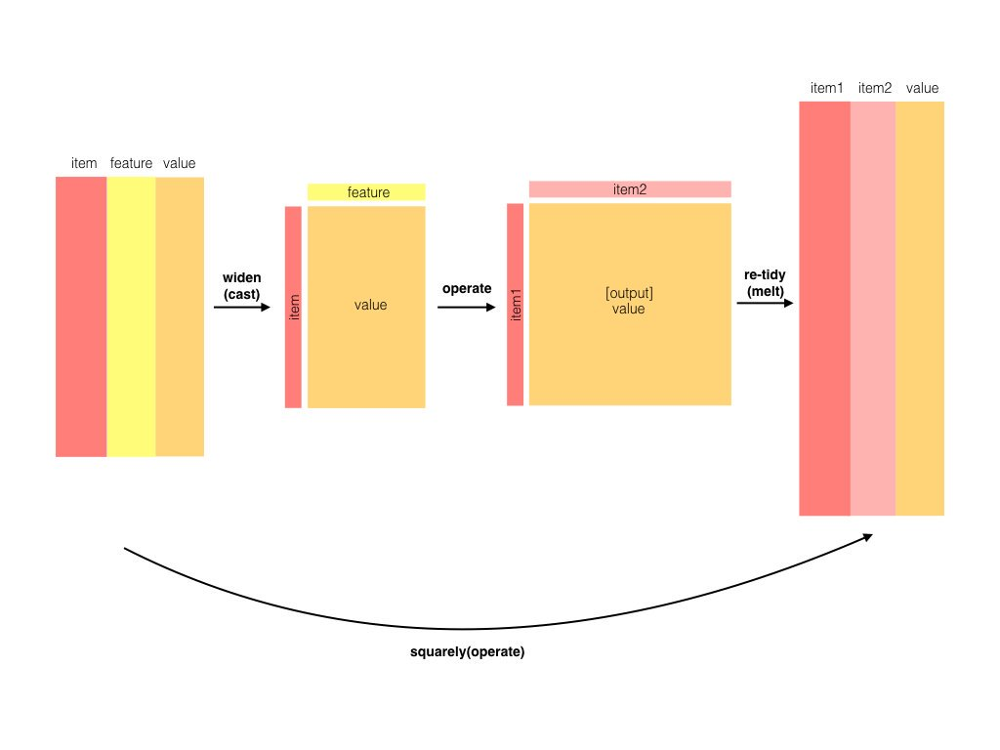

# Working with combinations of words using n-grams and widyr {#ngrams}

```{r echo = FALSE}
library(knitr)
opts_chunk$set(message = FALSE, warning = FALSE, cache = TRUE)

options(width = 100, dplyr.width = 150)
```

## Tokenizing by n-gram

We've been using the `unnest_tokens` function to tokenize by word, or sometimes by sentence or paragraph. But we can also tokenize into consecutive sequences of words, called **n-grams**.

```{r}
library(dplyr)
library(tidytext)
library(janeaustenr)

# Set n = 2 to divide into pairs of words
austen_digrams <- austen_books() %>%
  unnest_tokens(digram, text, token = "ngrams", n = 2)

austen_digrams
```

This is still tidy: it's one-row-per-token, but now each token represents a digram. Notice that these digrams are overlapping: "sense and" is one token, "and sensibility" is another.

### Counting and filtering n-grams

We can examine the most common digrams using `count`:

```{r}
austen_digrams %>%
  count(digram, sort = TRUE)
```

As expected, a lot of them are pairs of common (relatively uninteresting) words. This is a useful time to use tidyr's `separate()`, which splits a column into multiple based on a delimiter. This lets us separate it into two columns, "word1" and "word2", which we can remove stop-words from individually:

```{r}
library(tidyr)

digrams_separated <- austen_digrams %>%
  separate(digram, c("word1", "word2"), sep = " ")

digrams_filtered <- digrams_separated %>%
  filter(!word1 %in% stop_words$word) %>%
  filter(!word2 %in% stop_words$word)

digrams_filtered
```

We can now count the most common pairs of words:

```{r}
digrams_filtered %>% 
  count(word1, word2, sort = TRUE)
```

We can see that names (whether first and last or with a salutation) are the most common pairs in Jane Austen books.

We may want to work with the recombined words. tidyr's `unite()` is the opposite of `separate()`, and lets us recombine the columns into one.

```{r digrams_united, dependson = "digrams_filtered"}
digrams_united <- digrams_filtered %>%
  unite(digram, word1, word2, sep = " ")

digrams_united
```

You could also easily work with trigrams (sequences of 3 words) by setting `n = 3`:

```{r}
austen_books() %>%
  unnest_tokens(trigram, text, token = "ngrams", n = 3) %>%
  separate(trigram, c("word1", "word2", "word3"), sep = " ") %>%
  filter(!word1 %in% stop_words$word,
         !word2 %in% stop_words$word,
         !word3 %in% stop_words$word) %>%
  count(word1, word2, word3, sort = TRUE)
```

### Analyzing digrams

A digram can be treated like a term just as we treated a word. For example, we can look at TF-IDF of digrams:

```{r digram_tf_idf, dependson = "digram_counts"}
digram_tf_idf <- digrams_united %>%
  count(book, digram) %>%
  bind_tf_idf(digram, book, n) %>%
  arrange(desc(tf_idf))

digram_tf_idf
```

This can be visualized within each book, just as we did for words:

```{r digram_tf_idf_plot, dependson = "digram_tf_idf", echo = FALSE}
library(ggplot2)
theme_set(theme_bw())

digram_tf_idf %>%
  arrange(desc(tf_idf)) %>%
  top_n(12, tf_idf) %>%
  ungroup() %>%
  mutate(digram = reorder(digram, -tf_idf)) %>%
  ggplot(aes(digram, tf_idf)) +
  geom_bar(stat = "identity") +
  facet_wrap(~ book, scales = "free_x") +
  theme(axis.text.x = element_text(angle = 90, hjust = 1))
```

Much as we discovered in Chapter @ref{#tfidf}, the units that distinguish each Austen book are almost exclusively names.

### Using digrams to provide context in sentiment analysis

Our sentiment analysis approch in Chapter @ref{#sentiment} simply counted the appearance of positive or negative words, according to a reference lexicon. One of the problems with this approach is that a word's context matters nearly as much as its presence. For example, the words "happy" and "like" will be positive, even in a sentence like "I'm not **happy** and I don't **like** it!"

```{r}
digrams_separated %>%
  filter(word1 == "not") %>%
  count(word2, sort = TRUE)
```

We can use word2 to 

Let's use the AFINN lexicon for sentiment analysis, which gives a sentiment score for each word:

```{r AFINN_ngrams}
AFINN <- sentiments %>%
  filter(lexicon == "AFINN") %>%
  select(word, score)

AFINN
```

```{r not_words, dependson = c("austen_digrams", "AFINN_ngrams")}
not_words <- digrams_separated %>%
  filter(word1 == "not") %>%
  inner_join(AFINN, by = c(word2 = "word")) %>%
  count(word2, score, sort = TRUE) %>%
  ungroup()

not_words
```

It's worth asking which words contributed the most in the "wrong" direction. To compute that, we can multiply their score by the number of times they appear (so that a word with a sentiment score of +3 occurring 10 times has as much impact as a word with a sentiment score of +1 occurring 30 times).

```{r not_words_plot, dependson = "not_words"}
not_words %>%
  mutate(contribution = n * score) %>%
  arrange(desc(abs(contribution))) %>%
  head(20) %>%
  mutate(word2 = reorder(word2, contribution)) %>%
  ggplot(aes(word2, n * score, fill = n * score > 0)) +
  geom_bar(stat = "identity", show.legend = FALSE) +
  xlab("Words preceded by \"not\"") +
  ylab("Sentiment score * # of occurrences") +
  coord_flip()
```

The digrams "not like" and "not help" were overwhelmingly the largest causes of misidentification, making the text seem much more positive than it is. But we can see phrases like "not afraid" and "not fail" sometimes suggest text is more negative than it is.

"Not" isn't the only word that provides context. We could make a vector of words that we suspect , and use the same joining and counting approach to examine all of them:

```{r negated_words, dependson = "digrams_separated"}
negation_words <- c("not", "no", "never", "without")

negated_words <- digrams_separated %>%
  filter(word1 %in% negation_words) %>%
  inner_join(AFINN, by = c(word2 = "word")) %>%
  count(word1, word2, score, sort = TRUE) %>%
  ungroup()

negated_words
```

```{r negated_words_plot, dependson = "negated_words"}
negated_words %>%
  mutate(contribution = n * score) %>%
  mutate(word2 = reorder(word2, contribution)) %>%
  group_by(word1) %>%
  top_n(10, abs(contribution)) %>%
  ggplot(aes(word2, contribution, fill = n * score > 0)) +
  geom_bar(stat = "identity", show.legend = FALSE) +
  facet_wrap(~ word1, scales = "free") +
  xlab("Words preceded by \"not\"") +
  ylab("Sentiment score * # of occurrences") +
  theme(axis.text.x = element_text(angle = 90, hjust = 1))
```

## Visualizing digrams as a network with the ggraph package

A 

### Creating a network with igraph

Now that we have our 

```{r}
digram_counts <- digrams_filtered %>% 
  count(word1, word2, sort = TRUE)

digram_counts
```

Here we'll be referring to a "graph" not in the sense of a visualization, but as a . A graph can be created from a tidy object because a graph has three variables:

* **from**: the node an edge is coming from
* **to**: the node an edge is going towards
* **weight** A numeric value associated with each edge

```{r digram_graph, dependson = "digram_counts"}
library(igraph)

digram_graph <- digram_counts %>%
  filter(n > 20) %>%
  graph_from_data_frame()

digram_graph
```

The igraph package has many powerful functions for manipulating and analyzing networks.

TODO: examples of igraph package

### Visualizing a network with ggraph

igraph has plotting functions built in, but they're not what the package is designed to do. Many others have developed visualization methods for graphs. But we like the ggraph package, because it implements it in terms of the grammar of graphics.

```{r dependson = "digram_graph", }
library(ggraph)

set.seed(2016)

ggraph(digram_graph, layout = "fr") +
  geom_edge_link() +
  geom_node_point()
```

This gives an idea by adding the three ...

```{r dependson = "digram_graph"}
set.seed(2016)

ggraph(digram_graph, layout = "fr") +
  geom_edge_link() +
  geom_node_point() +
  geom_node_text(aes(label = name), vjust = 1, hjust = 1) +
  theme_void()
```

We can see the graph start to take shape.

* We add the `edge_alpha` aesthetic to the link layer to make links transparent based on how common or rare the digram is
* We add directionality with an arrow
* We tinker with the options to the node layer to make the points more attractive (larger, and blue)

```{r dependson = "digram_graph"}
set.seed(2016)

a <- grid::arrow(type = "closed", length = unit(.1, "inches"))

ggraph(digram_graph, layout = "fr") +
  geom_edge_link(aes(edge_alpha = n), show.legend = FALSE, arrow = a) +
  geom_node_point(color = "lightblue", size = 5) +
  geom_node_text(aes(label = name), vjust = 1, hjust = 1) +
  theme_void()
```

It may take a little more experimentation with your plots to get these graphs to work, but in the end we can visualize a lot this way.

### Visualizing digrams in other texts

We went to a good amount of work setting up this 

```{r}
count_digrams <- function(dataset) {
  dataset %>%
    unnest_tokens(digram, text, token = "ngrams", n = 2) %>%
    separate(digram, c("word1", "word2"), sep = " ") %>%
    filter(!word1 %in% stop_words$word) %>%
    filter(!word2 %in% stop_words$word) %>%
    count(word1, word2, sort = TRUE)
}

visualize_digrams <- function(digrams) {
  set.seed(2016)
  
  digrams %>%
    graph_from_data_frame() %>%
    ggraph(layout = "fr") +
    geom_edge_link(aes(edge_alpha = n), show.legend = FALSE, arrow = a) +
    geom_node_point(color = "lightblue", size = 5) +
    geom_node_text(aes(label = name), vjust = 1, hjust = 1) +
    theme_void()
}
```

We could visualize pairs in the King James Bible:

At that point, we could visualize digrams in other works, such as the King James Version of the Bible:

```{r eval = FALSE}
library(gutenbergr)
kjv <- gutenberg_download(10)
```

```{r kjv, echo = FALSE}
load("data/kjv.rda")
```

```{r kjv_digrams, dependson = "kjv"}
kjv_digrams <- kjv %>%
  count_digrams()

kjv_digrams
```

```{r dependson = "kjv_digrams"}
kjv_digrams %>%
  filter(n > 40) %>%
  visualize_digrams()
```

## Counting and correlating pairs of words with the widyr package

We've previously analyzed 

```{r austen_section_words}
austen_section_words <- austen_books() %>%
  filter(book == "Pride & Prejudice") %>%
  mutate(section = row_number() %/% 10) %>%
  unnest_tokens(word, text) %>%
  anti_join(stop_words, by = "word")
```



One example of the widyr pattern is the `pairwise_count` function. The prefix "pairwise" means it will result in one row for each pair of words in the `word` variable. This lets us count common pairs of words co-appearing within the same section:

```{r count_pairs_words, dependson = "austen_section_words"}
library(widyr)

word_pairs <- austen_section_words %>%
  pairwise_count(word, section, sort = TRUE)

word_pairs
```

For example, we discover that the most common pair of words in a section is "Elizabeth" and "Darcy" (the two main characters).

```{r}
word_pairs %>%
  filter(item1 == "darcy")
```

### Pairwise correlation

Pairs like "Elizabeth" and "Darcy" are the most common co-occurring words, but that's not particularly meaningful since **they're also the most common words.** We instead want to examine *correlation* among words, which is how often they appear together relative to how often they appear separately.

TODO: formula for Pearson correlation, explanation of phi coefficient

The `pairwise_cor()` function in widyr lets us perform a Pearson correlation across words.

```{r}
library(widyr)

# We need to filter for at least relatively common words first
word_cors <- austen_section_words %>%
  group_by(word) %>%
  filter(n() >= 20) %>%
  pairwise_cor(word, section, sort = TRUE)

word_cors
```

We could find the words most correlated with Elizabeth:

```{r}
word_cors %>%
  filter(item1 == "darcy")
```

### Visualizing word correlations

Just as we used ggraph to visualize digrams, we can use it to visualize correlations and clusters among words that we've found through the widyr package.

This graph is an early placeholder, needs to be adjusted:

```{r}
word_cors %>%
  filter(correlation > .15) %>%
  graph_from_data_frame() %>%
  ggraph(layout = "fr") +
  geom_edge_link(aes(edge_alpha = correlation), show.legend = FALSE) +
  geom_node_point(color = "lightblue", size = 5) +
  geom_node_text(aes(label = name), vjust = 1, hjust = 1) +
  theme_void()
```

Note that unlike the digram analysis, the relationship here aren't directional.

This kind of correlation network is a very useful and flexible visualization, and we'll examine it further in later chapters.
