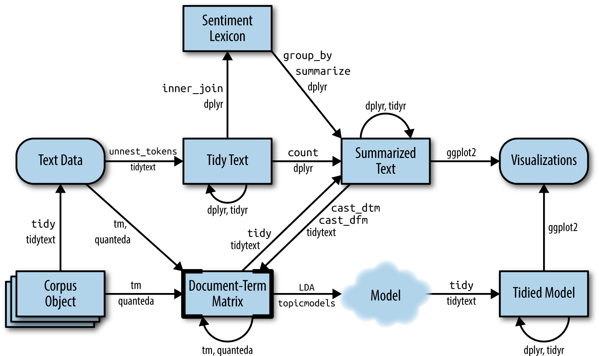

# Topic modeling {#topicmodeling}

In text mining, we often have collections of documents, such as blog posts or news articles, that we'd like to divide into natural groups so that we can understand them separately. Topic modeling is a method for unsupervised classification of such documents, similar to clustering on numeric data, which finds natural groups of items even when we're not sure what we're looking for.

Latent Dirichlet allocation (LDA) is a particularly popular method for fitting a topic model. It treats each document as a mixture of topics, and each topic as a mixture of words. This allows documents to "overlap" each other in terms of content, rather than being separated into discrete groups, in a way that mirrors typical use of natural language.

```{r tidyflowchartch6, echo = FALSE, out.width = '100%', fig.cap = "A flowchart of a text analysis that incorporates topic modeling. The topicmodels package takes a Document-Term Matrix as input and produces a model that can be tided by tidytext, such that it can be manipulated and visualized with dplyr and ggplot2."}

```

As Figure \@ref(fig:tidyflowchartch6) shows, we can use tidy text principles to approach topic modeling with the same set of tidy tools we've used throughout this book. In this chapter, we'll learn to work with `LDA` objects from the [topicmodels package](https://cran.r-project.org/package=topicmodels), particularly tidying such models so that they can be manipulated with ggplot2 and dplyr. We'll also explore an example of clustering chapters from several books, where we can see that a topic model "learns" to tell the difference between the four books based on the text content.

## Latent Dirichlet allocation

Latent Dirichlet allocation is one of the most common algorithms for topic modeling. Without diving into the math behind the model, we can understand it as being guided by two principles.

* **Every document is a mixture of topics.** We imagine that each document may contain words from several topics in particular proportions. For example, in a two-topic model we could say "Document 1 is 90% topic A and 10% topic B, while Document 2 is 30% topic A and 70% topic B."
* **Every topic is a mixture of words.** For example, we could imagine a two-topic model of American news, with one topic for "politics" and one for "entertainment." The most common words in the politics topic might be "President", "Congress", and "government", while the entertainment topic may be made up of words such as "movies", "television", and "actor". Importantly, words can be shared between topics; a word like "budget" might appear in both equally.

LDA is a mathematical method for estimating both of these at the same time: finding the mixture of words that is associated with each topic, while also determining the mixture of topics that describes each document. There are a number of existing implementations of this algorithm, and we'll explore one of them in depth.

In Chapter \@ref(dtm) we briefly introduced the `AssociatedPress` dataset provided by the topicmodels package, as an example of a DocumentTermMatrix. This is a collection of 2246 news articles from an American news agency, mostly published around 1988.

```{r}
library(topicmodels)

data("AssociatedPress")
AssociatedPress
```

We can use the `LDA()` function from the topicmodels package, setting `k = 2`, to create a two-topic LDA model.

```{block, type = "rmdnote"}
Almost any topic model in practice will use a larger `k`, but we will soon see that this analysis approach extends to a larger number of topics.
```

This function returns an object containing the full details of the model fit, such as how words are associated with topics and how topics are associated with documents.

```{r ap_lda}
# set a seed so that the output of the model is predictable
ap_lda <- LDA(AssociatedPress, k = 2, control = list(seed = 1234))
ap_lda
```

Fitting the model was the "easy part": the rest of the analysis will involve exploring and interpreting the model using tidying functions from the tidytext package.

### Word-topic probabilities

In Chapter \@ref(dtm) we introduced the `tidy()` method, originally from the broom package [@R-broom], for tidying model objects. The tidytext package provides this method for extracting the per-topic-per-word probabilities, called $\beta$ ("beta"), from the model.

```{r ap_topics}
library(tidytext)

ap_topics <- tidy(ap_lda, matrix = "beta")
ap_topics
```

Notice that this has turned the model into a one-topic-per-term-per-row format. For each combination, the model computes the probability of that term being generated from that topic. For example, the term "aaron" has a $`r ap_topics$beta[1]`$ probability of being generated from topic 1, but a $`r ap_topics$beta[2]`$ probability of being generated from topic 2.

We could use dplyr's `slice_max()` to find the 10 terms that are most common within each topic. As a tidy data frame, this lends itself well to a ggplot2 visualization (Figure \@ref(fig:aptoptermsplot)).

```{r aptoptermsplot, dependson = "ap_topics", fig.height=4, fig.width=7, fig.cap = "The terms that are most common within each topic"}
library(ggplot2)
library(dplyr)

ap_top_terms <- ap_topics %>%
  group_by(topic) %>%
  slice_max(beta, n = 10) %>% 
  ungroup() %>%
  arrange(topic, -beta)

ap_top_terms %>%
  mutate(term = reorder_within(term, beta, topic)) %>%
  ggplot(aes(beta, term, fill = factor(topic))) +
  geom_col(show.legend = FALSE) +
  facet_wrap(~ topic, scales = "free") +
  scale_y_reordered()
```

This visualization lets us understand the two topics that were extracted from the articles. The most common words in topic 1 include "percent", "million", "billion", and "company", which suggests it may represent business or financial news. Those most common in topic 2 include "president", "government", and "soviet", suggesting that this topic represents political news. One important observation about the words in each topic is that some words, such as "new" and "people", are common within both topics. This is an advantage of topic modeling as opposed to "hard clustering" methods: topics used in natural language could have some overlap in terms of words.

As an alternative, we could consider the terms that had the *greatest difference* in $\beta$ between topic 1 and topic 2. This can be estimated based on the log ratio of the two: $\log_2(\frac{\beta_2}{\beta_1})$ (a log ratio is useful because it makes the difference symmetrical: $\beta_2$ being twice as large leads to a log ratio of 1, while $\beta_1$ being twice as large results in -1). To constrain it to a set of especially relevant words, we can filter for relatively common words, such as those that have a $\beta$ greater than 1/1000 in at least one topic.

```{r beta_wide}
library(tidyr)

beta_wide <- ap_topics %>%
  mutate(topic = paste0("topic", topic)) %>%
  pivot_wider(names_from = topic, values_from = beta) %>% 
  filter(topic1 > .001 | topic2 > .001) %>%
  mutate(log_ratio = log2(topic2 / topic1))

beta_wide
```

The words with the greatest differences between the two topics are visualized in Figure \@ref(fig:topiccompare).

(ref:topiccap) Words with the greatest difference in $\beta$ between topic 2 and topic 1

```{r topiccompare, dependson = "beta_wide", fig.cap = "(ref:topiccap)", echo = FALSE}
beta_wide %>%
  group_by(direction = log_ratio > 0) %>%
  slice_max(abs(log_ratio), n = 10) %>% 
  ungroup() %>%
  mutate(term = reorder(term, log_ratio)) %>%
  ggplot(aes(log_ratio, term)) +
  geom_col() +
  labs(x = "Log2 ratio of beta in topic 2 / topic 1", y = NULL)
```

We can see that the words more common in topic 2 include political parties such as "democratic" and "republican", as well as politician's names such as "dukakis" and "gorbachev". Topic 1 was more characterized by currencies like "yen" and "dollar", as well as financial terms such as "index", "prices" and "rates". This helps confirm that the two topics the algorithm identified were political and financial news.

### Document-topic probabilities

Besides estimating each topic as a mixture of words, LDA also models each document as a mixture of topics. We can examine the per-document-per-topic probabilities, called $\gamma$ ("gamma"), with the `matrix = "gamma"` argument to `tidy()`.

```{r ap_documents}
ap_documents <- tidy(ap_lda, matrix = "gamma")
ap_documents
```

Each of these values is an estimated proportion of words from that document that are generated from that topic. For example, the model estimates that only about `r percent(ap_documents$gamma[1])` of the words in document 1 were generated from topic 1.

We can see that many of these documents were drawn from a mix of the two topics, but that document 6 was drawn almost entirely from topic 2, having a $\gamma$ from topic 1 close to zero. To check this answer, we could `tidy()` the document-term matrix (see Chapter \@ref(tidy-dtm)) and check what the most common words in that document were.

```{r ap_document_6}
tidy(AssociatedPress) %>%
  filter(document == 6) %>%
  arrange(desc(count))
```

Based on the most common words, this appears to be an article about the relationship between the American government and Panamanian dictator Manuel Noriega, which means the algorithm was right to place it in topic 2 (as political/national news).

## Example: the great library heist {#library-heist}

When examining a statistical method, it can be useful to try it on a very simple case where you know the "right answer". For example, we could collect a set of documents that definitely relate to four separate topics, then perform topic modeling to see whether the algorithm can correctly distinguish the four groups. This lets us double-check that the method is useful, and gain a sense of how and when it can go wrong. We'll try this with some data from classic literature.

Suppose a vandal has broken into your study and torn apart four of your books:

* *Great Expectations* by Charles Dickens
* *The War of the Worlds* by H.G. Wells
* *Twenty Thousand Leagues Under the Sea* by Jules Verne
* *Pride and Prejudice* by Jane Austen

This vandal has torn the books into individual chapters, and left them in one large pile. How can we restore these disorganized chapters to their original books? This is a challenging problem since the individual chapters are **unlabeled**: we don't know what words might distinguish them into groups. We'll thus use topic modeling to discover how chapters cluster into distinct topics, each of them (presumably) representing one of the books.

We'll retrieve the text of these four books using the gutenbergr package introduced in Chapter \@ref(tfidf).

```{r titles}
titles <- c("Twenty Thousand Leagues under the Sea", 
            "The War of the Worlds",
            "Pride and Prejudice", 
            "Great Expectations")
```

```{r eval = FALSE}
library(gutenbergr)

books <- gutenberg_works(title %in% titles) %>%
  gutenberg_download(meta_fields = "title")
```

```{r topic_books, echo = FALSE}
load("data/books.rda")
```

As pre-processing, we divide these into chapters, use tidytext's `unnest_tokens()` to separate them into words, then remove `stop_words`. We're treating every chapter as a separate "document", each with a name like `Great Expectations_1` or `Pride and Prejudice_11`. (In other applications, each document might be one newspaper article, or one blog post).

```{r word_counts, dependson = "topic_books"}
library(stringr)

# divide into documents, each representing one chapter
by_chapter <- books %>%
  group_by(title) %>%
  mutate(chapter = cumsum(str_detect(
    text, regex("^chapter ", ignore_case = TRUE)
  ))) %>%
  ungroup() %>%
  filter(chapter > 0) %>%
  unite(document, title, chapter)

# split into words
by_chapter_word <- by_chapter %>%
  unnest_tokens(word, text)

# find document-word counts
word_counts <- by_chapter_word %>%
  anti_join(stop_words) %>%
  count(document, word, sort = TRUE)

word_counts
```

### LDA on chapters

Right now our data frame `word_counts` is in a tidy form, with one-term-per-document-per-row, but the topicmodels package requires a `DocumentTermMatrix`. As described in Chapter \@ref(cast-dtm), we can cast a one-token-per-row table into a `DocumentTermMatrix` with tidytext's `cast_dtm()`.

```{r chapters_dtm}
chapters_dtm <- word_counts %>%
  cast_dtm(document, word, n)

chapters_dtm
```

We can then use the `LDA()` function to create a four-topic model. In this case we know we're looking for four topics because there are four books; in other problems we may need to try a few different values of `k`.

```{r chapters_lda}
chapters_lda <- LDA(chapters_dtm, k = 4, control = list(seed = 1234))
chapters_lda
```

Much as we did on the Associated Press data, we can examine per-topic-per-word probabilities.

```{r chapter_topics}
chapter_topics <- tidy(chapters_lda, matrix = "beta")
chapter_topics
```

Notice that this has turned the model into a one-topic-per-term-per-row format. For each combination, the model computes the probability of that term being generated from that topic. For example, the term "joe" has an almost zero probability of being generated from topics 1, 2, or 3, but it makes up `r percent(chapter_topics$beta[4])` of topic 4.

We could use dplyr's `slice_max()` to find the top 5 terms within each topic.

```{r top_terms}
top_terms <- chapter_topics %>%
  group_by(topic) %>%
  slice_max(beta, n = 5) %>% 
  ungroup() %>%
  arrange(topic, -beta)

top_terms
```

This tidy output lends itself well to a ggplot2 visualization (Figure \@ref(fig:toptermsplot)).

```{r toptermsplot, fig.height=6, fig.width=7, fig.cap = "The terms that are most common within each topic"}
library(ggplot2)

top_terms %>%
  mutate(term = reorder_within(term, beta, topic)) %>%
  ggplot(aes(beta, term, fill = factor(topic))) +
  geom_col(show.legend = FALSE) +
  facet_wrap(~ topic, scales = "free") +
  scale_y_reordered()
```

These topics are pretty clearly associated with the four books! There's no question that the topic of "captain", "nautilus", "sea", and "nemo" belongs to *Twenty Thousand Leagues Under the Sea*, and that "jane", "darcy", and "elizabeth" belongs to *Pride and Prejudice*. We see "pip" and "joe" from *Great Expectations* and "martians", "black", and "night" from *The War of the Worlds*. We also notice that, in line with LDA being a "fuzzy clustering" method, there can be words in common between multiple topics, such as "miss" in topics 1 and 4, and "time" in topics 3 and 4.

### Per-document classification {#per-document}

Each document in this analysis represented a single chapter. Thus, we may want to know which topics are associated with each document. Can we put the chapters back together in the correct books? We can find this by examining the per-document-per-topic probabilities, $\gamma$ ("gamma").

```{r chapters_gamma_raw}
chapters_gamma <- tidy(chapters_lda, matrix = "gamma")
chapters_gamma
```

Each of these values is an estimated proportion of words from that document that are generated from that topic. For example, the model estimates that each word in the `r chapters_gamma$document[1]` document has only a `r percent(chapters_gamma$gamma[1])` probability of coming from topic 1 (Pride and Prejudice).

Now that we have these topic probabilities, we can see how well our unsupervised learning did at distinguishing the four books. We'd expect that chapters within a book would be found to be mostly (or entirely), generated from the corresponding topic.

First we re-separate the document name into title and chapter, after which we can visualize the per-document-per-topic probability for each (Figure \@ref(fig:chaptersldagamma)).

```{r chapters_gamma}
chapters_gamma <- chapters_gamma %>%
  separate(document, c("title", "chapter"), sep = "_", convert = TRUE)

chapters_gamma
```

```{r chaptersldagamma, fig.width=6, fig.height=6, fig.cap = "The gamma probabilities for each chapter within each book"}
# reorder titles in order of topic 1, topic 2, etc before plotting
chapters_gamma %>%
  mutate(title = reorder(title, gamma * topic)) %>%
  ggplot(aes(factor(topic), gamma)) +
  geom_boxplot() +
  facet_wrap(~ title) +
  labs(x = "topic", y = expression(gamma))
```

We notice that almost all of the chapters from *Pride and Prejudice*, *War of the Worlds*, and *Twenty Thousand Leagues Under the Sea* were uniquely identified as a single topic each.

It does look like some chapters from Great Expectations (which should be topic 4) were somewhat associated with other topics. Are there any cases where the topic most associated with a chapter belonged to another book? First we'd find the topic that was most associated with each chapter using `slice_max()`, which is effectively the "classification" of that chapter.

```{r chapter_classifications, dependson = "chapters_gamma"}
chapter_classifications <- chapters_gamma %>%
  group_by(title, chapter) %>%
  slice_max(gamma) %>%
  ungroup()

chapter_classifications
```

We can then compare each to the "consensus" topic for each book (the most common topic among its chapters), and see which were most often misidentified.

```{r book_topics, dependson = "chapter_classifications"}
book_topics <- chapter_classifications %>%
  count(title, topic) %>%
  group_by(title) %>%
  slice_max(n, n = 1) %>% 
  ungroup() %>%
  transmute(consensus = title, topic)

chapter_classifications %>%
  inner_join(book_topics, by = "topic") %>%
  filter(title != consensus)
```

We see that only two chapters from *Great Expectations* were misclassified, as LDA described one as coming from the "Pride and Prejudice" topic (topic 1) and one from The War of the Worlds (topic 3). That's not bad for unsupervised clustering!

### By word assignments: `augment`

One step of the LDA algorithm is assigning each word in each document to a topic. The more words in a document are assigned to that topic, generally, the more weight (`gamma`) will go on that document-topic classification.

We may want to take the original document-word pairs and find which words in each document were assigned to which topic. This is the job of the `augment()` function, which also originated in the broom package as a way of tidying model output. While `tidy()` retrieves the statistical components of the model, `augment()` uses a model to add information to each observation in the original data.

```{r assignments, dependson = "chapters_lda"}
assignments <- augment(chapters_lda, data = chapters_dtm)
assignments
```

This returns a tidy data frame of book-term counts, but adds an extra column: `.topic`, with the topic each term was assigned to within each document. (Extra columns added by `augment` always start with `.`, to prevent overwriting existing columns). We can combine this `assignments` table with the consensus book titles to find which words were incorrectly classified.

```{r assignments2, dependson = c("assignments", "book_topics")}
assignments <- assignments %>%
  separate(document, c("title", "chapter"), 
           sep = "_", convert = TRUE) %>%
  inner_join(book_topics, by = c(".topic" = "topic"))

assignments
```

This combination of the true book (`title`) and the book assigned to it (`consensus`) is useful for further exploration. We can, for example, visualize a **confusion matrix**, showing how often words from one book were assigned to another, using dplyr's `count()` and ggplot2's `geom_tile` (Figure \@ref(fig:confusionmatrix)).

```{r confusionmatrix, dependson = "assignments2", fig.cap = "Confusion matrix showing where LDA assigned the words from each book. Each row of this table represents the true book each word came from, and each column represents what book it was assigned to."}
library(scales)

assignments %>%
  count(title, consensus, wt = count) %>%
  mutate(across(c(title, consensus), ~str_wrap(., 20))) %>%
  group_by(title) %>%
  mutate(percent = n / sum(n)) %>%
  ggplot(aes(consensus, title, fill = percent)) +
  geom_tile() +
  scale_fill_gradient2(high = "darkred", label = percent_format()) +
  theme_minimal() +
  theme(axis.text.x = element_text(angle = 90, hjust = 1),
        panel.grid = element_blank()) +
  labs(x = "Book words were assigned to",
       y = "Book words came from",
       fill = "% of assignments")
```

We notice that almost all the words for *Pride and Prejudice*, *Twenty Thousand Leagues Under the Sea*, and *War of the Worlds* were correctly assigned, while *Great Expectations* had a fair number of misassigned words (which, as we saw above, led to two chapters getting misclassified).

What were the most commonly mistaken words?

```{r wrong_words, dependson = "assignments2"}
wrong_words <- assignments %>%
  filter(title != consensus)

wrong_words

wrong_words %>%
  count(title, consensus, term, wt = count) %>%
  ungroup() %>%
  arrange(desc(n))
```

We can see that a number of words were often assigned to the Pride and Prejudice or War of the Worlds cluster even when they appeared in Great Expectations. For some of these words, such as "love" and "lady", that's because they're more common in Pride and Prejudice (we could confirm that by examining the counts).

On the other hand, there are a few wrongly classified words that never appeared in the novel they were misassigned to. For example, we can confirm "flopson" appears only in *Great Expectations*, even though it's assigned to the "Pride and Prejudice" cluster.

```{r dependson = "word_counts"}
word_counts %>%
  filter(word == "flopson")
```

The LDA algorithm is stochastic, and it can accidentally land on a topic that spans multiple books.

## Alternative LDA implementations

The `LDA()` function in the topicmodels package is only one implementation of the latent Dirichlet allocation algorithm. For example, the [mallet](https://cran.r-project.org/package=mallet) package [@R-mallet] implements a wrapper around the [MALLET](http://mallet.cs.umass.edu/) Java package for text classification tools, and the tidytext package provides tidiers for this model output as well.

The mallet package takes a somewhat different approach to the input format. For instance, it takes non-tokenized documents and performs the tokenization itself, and requires a separate file of stopwords. This means we have to collapse the text into one string for each document before performing LDA.

```{r cache = FALSE, echo = FALSE}
library(dplyr)
library(tidytext)
library(stringr)

library(ggplot2)
theme_set(theme_light())
```

```{r mallet_model, results = "hide", cache = FALSE, eval = FALSE}
library(mallet)

# create a vector with one string per chapter
collapsed <- by_chapter_word %>%
  anti_join(stop_words, by = "word") %>%
  mutate(word = str_replace(word, "'", "")) %>%
  group_by(document) %>%
  summarize(text = paste(word, collapse = " "))

# create an empty file of "stopwords"
file.create(empty_file <- tempfile())
docs <- mallet.import(collapsed$document, collapsed$text, empty_file)

mallet_model <- MalletLDA(num.topics = 4)
mallet_model$loadDocuments(docs)
mallet_model$train(100)
```

Once the model is created, however, we can use the `tidy()` and `augment()` functions described in the rest of the chapter in an almost identical way. This includes extracting the probabilities of words within each topic or topics within each document.

```{r cache = FALSE, eval = FALSE}
# word-topic pairs
tidy(mallet_model)

# document-topic pairs
tidy(mallet_model, matrix = "gamma")

# column needs to be named "term" for "augment"
term_counts <- rename(word_counts, term = word)
augment(mallet_model, term_counts)
```

We could use ggplot2 to explore and visualize the model in the same way we did the LDA output.

## Summary

This chapter introduces topic modeling for finding clusters of words that characterize a set of documents, and shows how the `tidy()` verb lets us explore and understand these models using dplyr and ggplot2. This is one of the advantages of the tidy approach to model exploration: the challenges of different output formats are handled by the tidying functions, and we can explore model results using a standard set of tools. In particular, we saw that topic modeling is able to separate and distinguish chapters from four separate books, and explored the limitations of the model by finding words and chapters that it assigned incorrectly.
