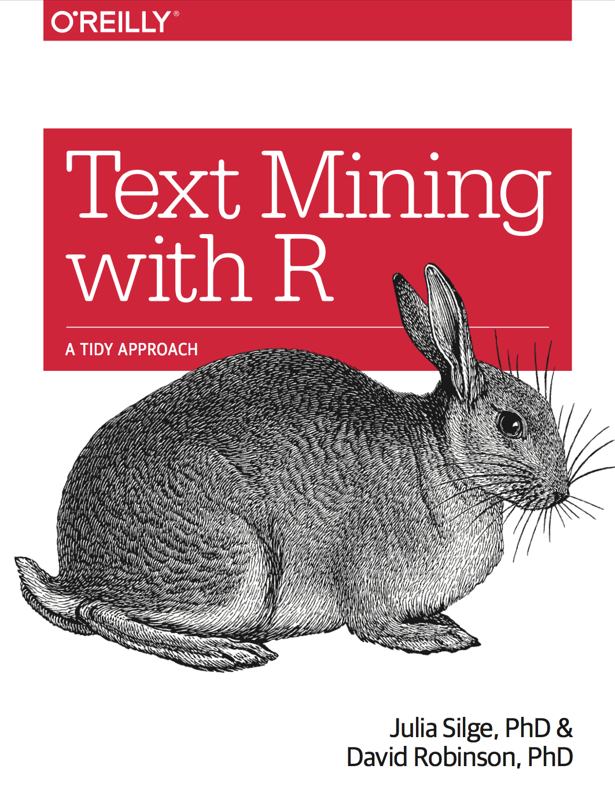

--- 
title: "Text Mining with R"
subtitle: "A Tidy Approach"
author: "Julia Silge and David Robinson"
date: "`r Sys.Date()`"
knit: "bookdown::render_book"
site: bookdown::bookdown_site
output: bookdown::bs4_book
documentclass: book
bibliography: [book.bib]
biblio-style: apalike
link-citations: true
links-as-notes: true
colorlinks: true
github-repo: dgrtwo/tidy-text-mining
cover-image: images/cover.png
url: https://www.tidytextmining.com/
description: "A guide to text analysis within the tidy data framework, using the tidytext package and other tidy tools"
---

```{r include=FALSE}
# automatically create a bib database for R packages
knitr::write_bib(c(
  .packages(), 'bookdown', 'knitr', 'rmarkdown', 'rmallet'
), 'packages.bib')
```

# Welcome to Text Mining with R {-}

<a href="http://amzn.to/2tZkmxG"></a>

This is the [website](http://tidytextmining.com/) for *Text Mining with R*! Visit the [GitHub repository for this site](https://github.com/dgrtwo/tidy-text-mining), find the book at [O'Reilly](http://www.jdoqocy.com/click-4428796-11290546?url=http%3A%2F%2Fshop.oreilly.com%2Fproduct%2F0636920067153.do%3Fcmp%3Daf-strata-books-video-product_cj_0636920067153_%25zp&cjsku=0636920067153), or [buy it on Amazon](http://amzn.to/2tZkmxG).

This work by [Julia Silge](http://juliasilge.com/) and [David Robinson](http://varianceexplained.org/) is licensed under a <a rel="license" href="http://creativecommons.org/licenses/by-nc-sa/3.0/us/">Creative Commons Attribution-NonCommercial-ShareAlike 3.0 United States License</a>.

<a rel="license" href="http://creativecommons.org/licenses/by-nc-sa/3.0/us/"></a>

<a href="https://www.netlify.com">  </a>


<script>
  (function(i,s,o,g,r,a,m){i['GoogleAnalyticsObject']=r;i[r]=i[r]||function(){
  (i[r].q=i[r].q||[]).push(arguments)},i[r].l=1*new Date();a=s.createElement(o),
  m=s.getElementsByTagName(o)[0];a.async=1;a.src=g;m.parentNode.insertBefore(a,m)
  })(window,document,'script','https://www.google-analytics.com/analytics.js','ga');

  ga('create', 'UA-68765210-2', 'auto');
  ga('send', 'pageview');

</script>

# Preface {-}

If you work in analytics or data science, like we do, you are familiar with the fact that data is being generated all the time at ever faster rates. (You may even be a little weary of people pontificating about this fact.) Analysts are often trained to handle tabular or rectangular data that is mostly numeric, but much of the data proliferating today is unstructured and text-heavy. Many of us who work in analytical fields are not trained in even simple interpretation of natural language.

We developed the [tidytext](https://github.com/juliasilge/tidytext) [@R-tidytext] R package because we were familiar with many methods for data wrangling and visualization, but couldn't easily apply these same methods to text. We found that using tidy data principles can make many text mining tasks easier, more effective, and consistent with tools already in wide use. Treating text as data frames of individual words allows us to manipulate, summarize, and visualize the characteristics of text easily and integrate natural language processing into effective workflows we were already using.

This book serves as an introduction of text mining using the tidytext package and other tidy tools in R. The functions provided by the tidytext package are relatively simple; what is important are the possible applications. Thus, this book provides compelling examples of real text mining problems.

## Outline {-}

We start by introducing the tidy text format, and some of the ways dplyr, tidyr, and tidytext allow informative analyses of this structure.

* **Chapter \@ref(tidytext)** outlines the tidy text format and the `unnest_tokens()` function. It also introduces the gutenbergr and janeaustenr packages, which provide useful literary text datasets that we'll use throughout this book.
* **Chapter \@ref(sentiment)** shows how to perform sentiment analysis on a tidy text dataset, using the `sentiments` dataset from tidytext and `inner_join()` from dplyr.
* **Chapter \@ref(tfidf)** describes the tf-idf statistic (term frequency times inverse document frequency), a quantity used for identifying terms that are especially important to a particular document.
* **Chapter \@ref(ngrams)** introduces n-grams and how to analyze word networks in text using the widyr and ggraph packages.

Text won't be tidy at all stages of an analysis, and it is important to be able to convert back and forth between tidy and non-tidy formats.

* **Chapter \@ref(dtm)** introduces methods for tidying document-term matrices and corpus objects from the tm and quanteda packages, as well as for casting tidy text datasets into those formats.
* **Chapter \@ref(topicmodeling)** explores the concept of topic modeling, and uses the `tidy()` method to interpret and visualize the output of the topicmodels package. 

We conclude with several case studies that bring together multiple tidy text mining approaches we've learned.

* **Chapter \@ref(twitter)** demonstrates an application of a tidy text analysis by analyzing the authors' own Twitter archives. How do Dave's and Julia's tweeting habits compare?
* **Chapter \@ref(nasa)** explores metadata from over 32,000 NASA datasets (available in JSON) by looking at how keywords from the datasets are connected to title and description fields.
* **Chapter \@ref(usenet)** analyzes a dataset of Usenet messages from a diverse set of newsgroups (focused on topics like politics, hockey, technology, atheism, and more) to understand patterns across the groups.

## Topics this book does not cover {-}

This book serves as an introduction to the tidy text mining framework along with a collection of examples, but it is far from a complete exploration of natural language processing. The [CRAN Task View on Natural Language Processing](https://cran.r-project.org/web/views/NaturalLanguageProcessing.html) provides details on other ways to use R for computational linguistics. There are several areas that you may want to explore in more detail according to your needs.

* **Clustering, classification, and prediction:** Machine learning on text is a vast topic that could easily fill its own volume. We introduce one method of unsupervised clustering (topic modeling) in Chapter \@ref(topicmodeling) but many more machine learning algorithms can be used in dealing with text.
* **Word embedding:** One popular modern approach for text analysis is to map words to vector representations, which can then be used to examine linguistic relationships between words and to classify text. Such representations of words are not tidy in the sense that we consider here, but have found powerful applications in machine learning algorithms.
* **More complex tokenization:** The tidytext package trusts the tokenizers package [@R-tokenizers] to perform tokenization, which itself wraps a variety of tokenizers with a consistent interface, but many others exist for specific applications.
* **Languages other than English:** Some of our users have had success applying tidytext to their text mining needs for languages other than English, but we don't cover any such examples in this book.

## About this book {-}

This book is focused on practical software examples and data explorations. There are few equations, but a great deal of code. We especially focus on generating real insights from the literature, news, and social media that we analyze.

We don't assume any previous knowledge of text mining. Professional linguists and text analysts will likely find our examples elementary, though we are confident they can build on the framework for their own analyses.

We do assume that the reader is at least slightly familiar with dplyr, ggplot2, and the `%>%` "pipe" operator in R, and is interested in applying these tools to text data. For users who don't have this background, we recommend books such as [R for Data Science](http://r4ds.had.co.nz/). We believe that with a basic background and interest in tidy data, even a user early in their R career can understand and apply our examples.

## Using code examples {-}

This book was written in [RStudio](http://www.rstudio.com/ide/) using [bookdown](http://bookdown.org/). The [website](https://www.tidytextmining.com/) is hosted via [Netlify](http://netlify.com/), and automatically built after every push by [GitHub Actions](https://help.github.com/actions). While we show the code behind the vast majority of the analyses, in the interest of space we sometimes choose not to show the code generating a particular visualization if we've already provided the code for several similar graphs. We trust the reader can learn from and build on our examples, and the code used to generate the book can be found in our [public GitHub repository](https://github.com/dgrtwo/tidy-text-mining). We generated all plots in this book using [ggplot2](https://ggplot2.tidyverse.org/) and its light theme (`theme_light()`).

This version of the book was built with `r R.version.string` and the following packages:

```{r, echo = FALSE, results="asis"}
deps <- desc::desc_get_deps()
pkgs <- sort(deps$package[deps$type == "Imports"])
pkgs <- sessioninfo::package_info(pkgs, dependencies = FALSE)
df <- tibble::tibble(
  package = pkgs$package,
  version = pkgs$ondiskversion,
  source = gsub("@", "\\\\@", pkgs$source)
)
knitr::kable(df, format = "markdown")
```

## Acknowledgements {-}

We are so thankful for the contributions, help, and perspectives of people who have moved us forward in this project. There are several people and organizations we would like to thank in particular. 

We would like to thank Os Keyes and Gabriela de Queiroz for their contributions to the tidytext package, Lincoln Mullen for his work on the [tokenizers](https://github.com/ropensci/tokenizers) package, Kenneth Benoit for his work on the [quanteda](https://github.com/kbenoit/quanteda) package, Thomas Pedersen for his work on the [ggraph](https://github.com/thomasp85/ggraph) package, and Hadley Wickham for his work in framing tidy data principles and building tidy tools. We would also like to thank [rOpenSci](https://ropensci.org/), which hosted us at the unconference where we began work, and the [NASA Datanauts](https://open.nasa.gov/explore/datanauts/) program, for the opportunities and support they have provided Julia during her time with them. 

We received thoughtful, thorough technical reviews that improved the quality of this book significantly. We would like to thank Mara Averick, Carolyn Clayton, Simon Jackson, Sean Kross, and Lincoln Mullen for their investment of time and energy in these technical reviews.

```{r, eval = FALSE, echo = FALSE}
library(tidyverse)
contribs_all_json <- gh::gh("/repos/:owner/:repo/contributors",
  owner = "dgrtwo",
  repo = "tidy-text-mining",
  .limit = Inf
)
contribs_all <- tibble(
  login = contribs_all_json %>% map_chr("login"),
  n = contribs_all_json %>% map_int("contributions")
)
contribs_old <- read_csv("contributors.csv", col_types = list())
contribs_new <- contribs_all %>% anti_join(contribs_old, by = "login")
# Get info for new contributors
needed_json <- map(
  contribs_new$login, 
  ~ gh::gh("/users/:username", username = .x)
)
info_new <- tibble(
  login = contribs_new$login,
  name = map_chr(needed_json, "name", .default = NA),
  blog = map_chr(needed_json, "blog", .default = NA)
)
info_old <- contribs_old %>% select(login, name, blog)
info_all <- bind_rows(info_old, info_new)
contribs_all <- contribs_all %>% 
  left_join(info_all, by = "login") %>% 
  arrange(login)
write_csv(contribs_all, "contributors.csv")
```

```{r, results = "asis", echo = FALSE, message = FALSE}
library(dplyr)
contributors <- read.csv("contributors.csv", stringsAsFactors = FALSE)
contributors <- contributors %>% 
  filter(!login %in% c("dgrtwo", "juliasilge")) %>% 
  mutate(
    login = paste0("\\@", login),
    desc = ifelse(is.na(name), login, paste0(name, " (", login, ")"))
  )
cat("This book was written in the open, and several people contributed via pull requests or issues. Special thanks goes to those who contributed via GitHub pull requests (in alphabetical order by username): ", sep = "")
cat(paste0(contributors$desc, collapse = ", "))
cat(".\n")
```

Finally, we want to dedicate this book to our spouses, Robert and Dana. We both could produce a great deal of sentimental text on this subject but will restrict ourselves to heartfelt thanks.

