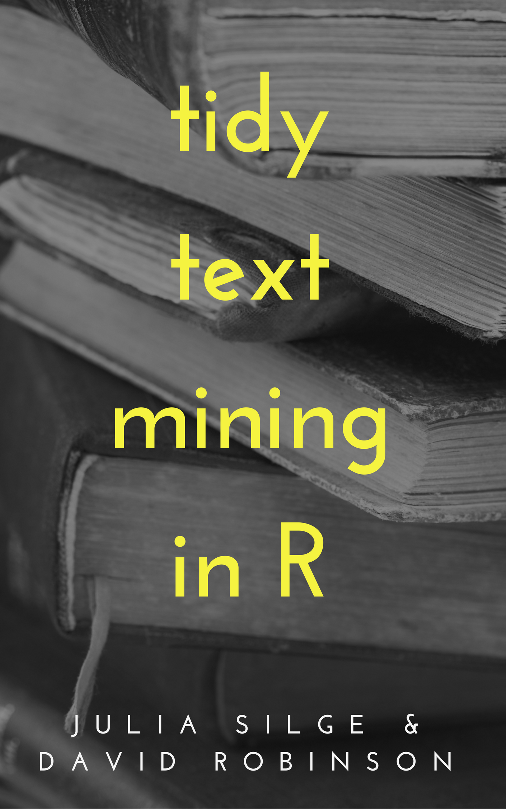

--- 
title: "Tidy Text Mining in R"
author: "Julia Silge and David Robinson"
date: "`r Sys.Date()`"
knit: "bookdown::render_book"
site: bookdown::bookdown_site
output: bookdown::gitbook
documentclass: book
bibliography: [book.bib, packages.bib]
biblio-style: apalike
link-citations: yes
github-repo: dgrtwo/tidy-text-mining
description: "A guide to text analysis within the tidy data framework, using the tidytext package and other tidy tools"
---

```{r include=FALSE}
# automatically create a bib database for R packages
knitr::write_bib(c(
  .packages(), 'bookdown', 'knitr', 'rmarkdown'
), 'packages.bib')
```



# Welcome to Tidy Text Mining in R {-}

This is the [website](http://tidytextmining.com/) for *Tidy Text Mining in R*! Visit the [GitHub repository for this site](https://github.com/dgrtwo/tidy-text-mining).

<a rel="license" href="http://creativecommons.org/licenses/by-nc-sa/3.0/us/"></a><br />This work by [Julia Silge](http://juliasilge.com/) and [David Robinson](http://varianceexplained.org/) is licensed under a <a rel="license" href="http://creativecommons.org/licenses/by-nc-sa/3.0/us/">Creative Commons Attribution-NonCommercial-ShareAlike 3.0 United States License</a>.
